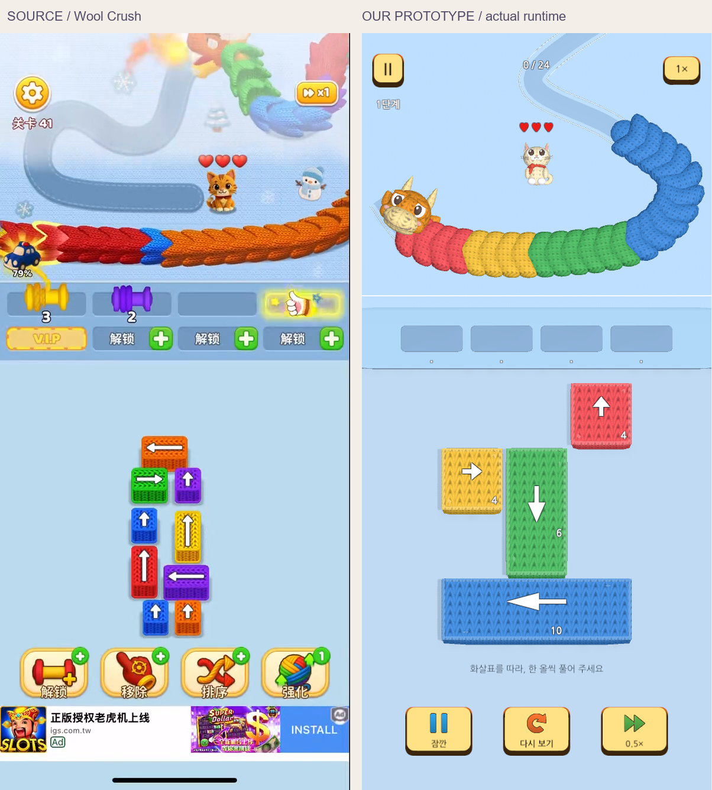
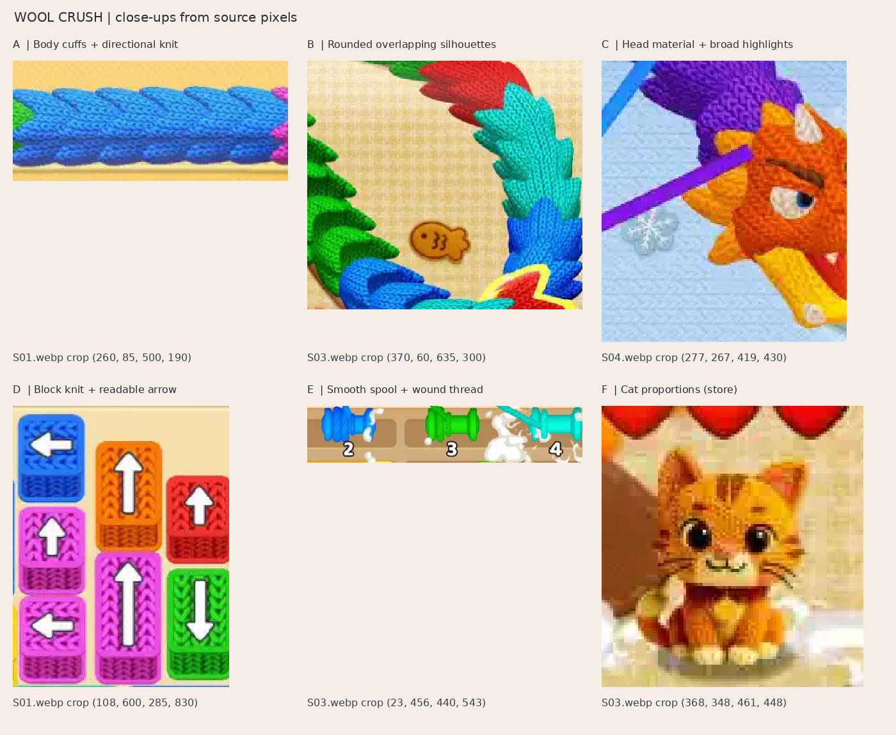
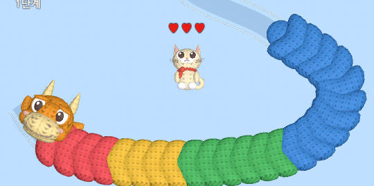
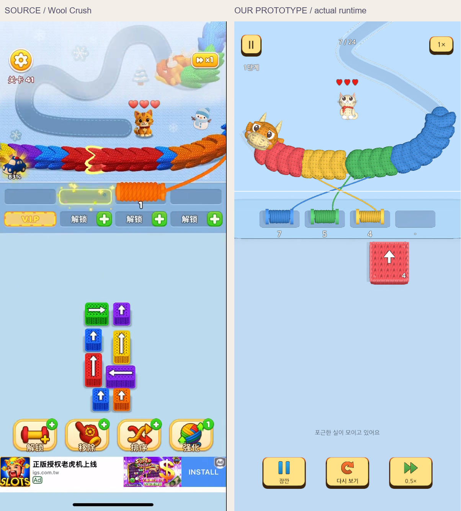

# 털실 마스터 재현 실패 원인과 전면 개편안

2026-09-10 · 조사 기준 커밋 `5d0b838` · 이번 문서는 원인 분석과 제안이다. 개편 구현 완료 보고가 아니다.

## 결론

대대적인 개편이 필요하다. 현재 결과물은 **방향 블록·실타래·용·고양이를 한 장면에서 동작시키는 시연**에는 도달했지만, 사용자가 원한 **털실 마스터에 가까운 화면과 플레이 감각**에는 도달하지 못했다.

주된 원인은 엔진이나 APK 제작 능력의 부족으로 보이지 않는다. **원작의 비율과 시각적 인상을 고정하기 전에 절차적 모델·공통 재질·실행 시 화면 생성에 구현을 맞췄고, 시연의 기능 성공을 중심으로 작업을 진행한 것**이 문제다. 이후 수정도 같은 구조 안에서 파라미터와 무늬를 바꾸는 방향에 머물렀다. 구현과 검수는 실제로 수행됐으므로 “아무것도 안 만들었다”, “아예 보지 않았다”는 진단도 정확하지 않다. 반복 검수에서 발견한 시각 미달을 다음 단계 진입과 최종 종료를 막는 기준으로 사용하지 못했다.

현재 목표는 독자 테마나 새 UI를 먼저 고안하는 것이 아니라 원작의 화면 구성·뜨개 질감·움직임·판단 흐름에 가까워지는 것이다. 원작 참고 화면은 비교 자료로 사용하며, 제작 자산은 직접 만든다.

## 조사 범위와 확실성

- 직접 본 자료: 최종 전체 화면, 뜨개 확대, 풀림 비교 화면, 원작 재질 확대 자료.
- 직접 읽은 코드: `WoolLab`, `WoolReferencePresentation`, `WoolGeometry`, `KnitLit`, `DemoSession`, `WoolLabBuilder`, 실제 설정 asset, 캐릭터·마디·재질 생성 스크립트.
- 최종 적용 자산을 GUID로 확인: `CloudDragonHead.fbx`, `CreamCat.fbx`, `RefinedKnitNormal.png`, `RefinedKnitAO.png`.
- 기존 검증 보고서와 실제 JSON, APK·시연 영상의 존재를 확인했다. 이번 분석에서 게임을 새로 실행하거나 Android에서 테스트하지는 않았다.
- 원작 내부 구현과 정확한 수집 우선순위는 확인하지 않았다. 원작에 대한 관찰, 기존 조사에서 제시한 추론, 이번 구현 제안을 구분한다.
- [공식 게임 페이지](https://play.google.com/store/apps/details?id=wool.match.color.sort.jam.puzzle)로 대상 식별을 재확인했다. 스토어 설명을 영상보다 우선하는 정밀 규칙 명세로 사용하지 않는다.

## 1. 화면의 큰 비율이 닮지 않았다

큰 영역의 순서는 맞다. 그러나 하단 네 블록이 화면을 크게 차지하고, 작업대와 배경은 넓은 평면으로 보이며, 하단 조작은 게임 도구보다 시연 제어판에 가깝다. 색과 요소 이름만 비슷해도 전체 인상이 다른 이유다.

`WoolLab.cs:124`의 `Grid`는 한 칸을 화면 폭의 `0.185`, 화면 높이의 `0.086` 간격으로 배치한다. 540×1170 화면에서는 중심 간격이 약 100×101px이다. 네 블록 배치를 거의 화면 폭 전체로 펼치는 값이다. 초기 시연을 네 블록으로 제한한 것 자체는 이전 요청에 맞지만, **작은 시연 데이터에 맞춰 블록의 시각적 크기까지 크게 늘린 선택**은 별개의 문제다.

`WoolReferencePresentation.cs:65–78`에는 상단과 하단의 정지·속도 제어가 중복되어 있다. 하트는 `:69`에서 항상 세 개를 그린다. 장면의 상태와 무관한 장식과 디버그 제어가 플레이 화면의 자리를 차지한다.

**개편:** 원작 실제 플레이 프레임의 게임 영역을 기준으로 화면 비율·블록 한 칸 크기·작업대 높이·문자 크기를 먼저 고정한다. 튜토리얼의 블록 수가 적어도 블록을 과도하게 확대하지 않는다. 본 퍼즐은 실제로 맞물리는 배치로 화면 밀도를 만든다. 광고·과금 영역을 제거한 공간은 재배치하되, 늘어난 공간을 거대한 시연 버튼으로 채우지 않는다.

## 2. 뜨개 재질을 크게, 강하게 적용하는 것으로 해결하려 했다

원작에서 중요한 것은 큰 마디의 겹침, 촘촘한 실 고리, 밝고 부드러운 명암의 조합이다. 현재 화면에서는 반복 요철이 강하게 드러나고, 얼굴의 굴곡까지 굵은 무늬가 덮어 표정을 읽기 어렵다.

확인한 원인은 다음과 같다.

- 실제 설정은 `stitchColumns: 8`이다. 블록 앞면은 `WoolReferencePresentation.cs:42`에서 별도로 5로 낮춘다. 시작값이 정답이라는 뜻은 아니지만, 무늬를 크게 하는 방향이 화면 전체의 촘촘함을 약화시켰다.
- `WoolLab.cs:91–114`는 몸통·주둥이·볼·목도리 등에 공통 `MakeYarn` 경로를 적용한다. 부위의 UV와 크기가 달라도 조직 밀도와 요철 성격을 별도로 설계하지 않는다.
- `physicalKnit`가 켜지면 `WoolLab.cs:94`에서 normal 강도를 `.85`로 고정해 `normalStrength` 설정을 덮어쓴다. 조정 가능한 것처럼 보이는 파라미터가 실제 결과에 반영되지 않는 경로다.
- `KnitLit.shader:64,71–74`는 AO를 최종 색 전체에 곱하고, 자체 조명식과 고정 환경광 값을 사용한다. 장면에서 지정한 Trilight ambient가 이 재질에 그대로 들어가는 구조가 아니다. 강한 골 음영과 다른 Lit 재질 사이의 명암 불일치를 만들 수 있다.
- 최종 재질 생성기 `refine_knit.py:57`은 여러 실 고리의 높이 중 최대값을 취해 하나의 높이장으로 합친다. 이 방법 자체가 잘못은 아니지만, 서로 포개진 실의 실제 위아래 관계·구멍·투과 그림자까지 자동으로 만들어 주지는 않는다. “실 모양 수식을 만들었다”는 것과 화면에서 실처럼 보인다는 것은 다르다.

**개편:** 몸통용 촘촘한 편물, 얼굴용 더 부드럽고 약한 조직, 블록의 앞면과 테두리, 매끈한 실타래 축, 실제 감기는 실 가닥을 각각 구분한다. 얼굴을 반드시 무늬 없는 재질로 바꾸자는 뜻이 아니다. 표정이 먼저 읽히고 가까이서 섬유가 읽히도록 밀도와 대비를 조절한다. 기본 조명은 URP Lit 기반에서 맞춘 뒤 풀림에 필요한 기능을 추가한다. [Unity Lit 자료](https://docs.unity3d.com/6000.3/Documentation/Manual/urp/lit-shader.html)

## 3. 모델의 제작 편의가 실루엣과 표정에 앞섰다

`rebuild_characters.py:17–32,56–99`는 구체와 변형 구체를 조합해 얼굴·주둥이·눈·볼을 만든다. 절차적 제작은 재현에 유리하며, 구체를 썼다는 이유만으로 품질이 낮아지는 것은 아니다. 문제는 최종 카메라에서의 실루엣과 표정이 약한 상태로 세부 재질을 더했다는 점이다.

`WoolLab.cs:208`은 용의 방향을 경로 방향과 고정 각도 사이에서 72% 섞는다. 따라서 목의 진행 방향과 얼굴의 향하는 방향이 다르게 읽힐 수 있다. 기본 카메라, 머리 방향, 눈과 주둥이의 배치가 함께 설계되어야 한다.

현재 캐릭터의 기본형을 계속 조금씩 부풀리기보다, 원작의 머리/몸통 비율과 낮은 시점에서도 읽히는 얼굴 구조를 기준으로 새 기본형을 만드는 편이 낫다. 회색 재질로 보았을 때 이미 용과 고양이가 귀여워야 한다. 그 상태에서 짧은 경로의 정면·측면·코너 자세를 확인하고 편물을 적용한다.

**개편 산출물:** 한 마디의 정면·옆면·위, 세 마디 겹침, 곡선 위 열두 마디, 실제 카메라 각도의 용 머리와 고양이, 눈깜박임·앞발 인사가 포함된 원본 모델. Blender 미리보기만으로 통과시키지 않고 Unity의 동일 카메라에서 판단한다.

## 4. 풀림은 주로 잘라내기, 감김은 주로 크기 변화다

`KnitLit.shader:56`의 풀림은 UV 한 축을 기준으로 표면을 잘라내는 방식이다. `WoolLab.cs:199–203`은 마디를 조금 이동·축소한다. `:250–255`의 실 시작점은 모델 표면에서 추출한 마커가 아니라 별도 수식으로 계산한다. `:245–247`의 코일은 수집 비율에 따라 반경과 회전수를 바꾼다.

각 요소는 동시에 변하지만, 이것만으로 “편물 한 끝이 풀리고 그 실이 이동하여 실타래 표면에 쌓인다”는 인과가 설득력 있게 보장되지는 않는다. 현재 비교 프레임에는 여러 실이 중앙에서 교차하는 장면도 있다. 교차 자체를 금지할 필요는 없지만 색과 목적지, 당겨지는 끝은 계속 읽혀야 한다.

**개편:** 하나의 `UnravelPresentation` 진행량으로 남은 표면·실 출발점·실의 흐름·감기는 위치·코일 누적량을 계산한다. 모델에는 풀림 방향과 끝점을 명시한다. 선택된 마디의 끝부분을 국소적으로 변형하고, 필요한 가장자리 고리만 실제 geometry로 표현한다. 전신의 모든 실을 물리 시뮬레이션할 필요는 없다. 1배속과 0.5배속에서 시작·중간·완료를 확인하고, 네 실이 동시에 존재하는 경우도 별도로 확인한다.

## 5. 게임의 긴장과 선택 구조가 빠져 있다

이는 이전의 제한된 시각 시연 범위와 구분해야 한다. 첫 요청의 네 블록 시연에는 맞는 단순화였지만, 현재 사용자가 원하는 원작에 가까운 게임에는 충분하지 않다.

| 항목 | 현재 코드 | 플레이에 미치는 영향 |
|---|---|---|
| 퍼즐 데이터 | `DemoSession.cs:36–45`에 네 블록과 위치 고정 | 짧은 탈출 예시 이상으로 확장하기 어려움 |
| 작업 자리 | 블록 4개, 자리 4개 | 새 블록을 위해 자리를 비울 필요가 거의 없음 |
| 용 이동 | `WoolLab.cs:191`의 정현파 위치 | 경로를 따라 다가오는 진행·위험이 없음 |
| 수집 대상 | `DemoSession.cs:132–134`에서 같은 색 첫 미소비 unit | 위치·노출 구간·다가올 색을 기다리는 판단이 없음 |
| 체력과 실패 | 상태에 체력/위험/실패 없음, UI 하트는 고정 | 고양이를 구한다는 목적과 플레이의 연결이 약함 |

기존 원작 조사에서는 **탈출 순서 + 제한된 자리 + 이동에 따라 달라지는 색 공급**을 핵심으로 설명한다. 다만 정확한 노출 함수와 모든 실패 경계는 미확정이다. 그 부분은 실제 원작 플레이에서 추가 관찰하거나 우리 규칙으로 명시해야 한다. [기존 원작 분석](../Wool_Crush_Design/01_REFERENCE_GAME_ANALYSIS.md), [기존 제품 규칙 제안](../Wool_Crush_Design/02_GAMEPLAY_SPEC.md)

**개편:** 기존 `DemoSession`은 회귀 검증용 시연으로 보존한다. 실제 게임에는 데이터로 읽는 블록·경로·색 공급과 제한된 작업 자리를 연결한다. 첫 완성 대상은 탈출 순서, 수집 대기, 자리 회수의 차이가 실제로 느껴지는 손으로 만든 한 레벨이다. 본 퍼즐의 블록 수는 네 작업 자리보다 많아야 한다. 수십 레벨 자동 생성은 이 한 레벨의 재미가 확인된 뒤의 일이다.

## 6. 미술을 조정하기 어려운 제작 구조다

`WoolLabBuilder.cs:50–55`가 저장하는 씬에는 실질적으로 루트와 컴포넌트만 있다. 카메라·조명·모델·UI·재질은 `WoolLab.BuildPresentation`에서 실행할 때 만든다. 화면 크기가 바뀌면 `:155–158`에서 전체 표현을 다시 만든다. 캐릭터 재질은 이름으로 분류해 실행 시 덮어쓰고, 아트 연결은 `WoolLabBuilder.BindArt`의 파일 검색과 이름 규칙으로 결정한다.

따라서 Editor에서 장면을 열어 구도·표면·조명을 직접 다듬고 저장하는 작업이 어렵고, 아트 수정이 코드 수정·재생성·빌드와 얽힌다. 확인용 렌더와 실제 게임의 재질·조명이 다르게 작동하는 통로도 생긴다. 이미 구현한 자산 수명 관리가 무효라는 뜻은 아니다. 시각적으로 수정할 수 있는 기반이 빈약하다는 뜻이다.

**개편:** 카메라·조명·환경·UI·모델 참조가 저장된 실제 씬과 Prefab을 사용한다. Editor 생성기는 처음 생성과 명시적 갱신을 맡고, 실행 중에는 상태와 동적 실만 갱신한다. 자산은 이름 추측 대신 명시적 참조와 모델 원점·UV·풀림 끝점 규약으로 연결한다. 화면 비율 변경은 배치 계산을 갱신하며, 불필요하게 모든 아트 자산을 다시 만들지 않는다. [Unity Prefab 자료](https://docs.unity3d.com/6000.3/Documentation/Manual/Prefabs.html)

## 7. 품질 판정이 구현 종료를 통제하지 못했다

기존 `13_VISUAL_VERTICAL_SLICE_SPEC.md`에는 이미 비교 방법과 아트 통과 조건이 있다. 코드·아트 검수와 여러 차례의 캡처도 존재한다. 따라서 문제는 기준 문서가 없었다는 것이 아니다.

실제로 통과한 증거는 입력 경로, 수집 완료, 다시 보기, 상태 유지, 실행 오류, APK 구조다. 중요한 성과지만 귀여움·뜨개 질감·만족스러운 감김을 증명하지 않는다. 최종 README도 시각 미달을 인정한다. 그래픽이 미달인데 결과물을 최종 상태처럼 묶고 작업을 끝낸 것이 사용자의 목적과 어긋났다.

앞으로는 제출 파일 수와 빌드 성공을 완성도의 대체 지표로 사용하지 않는다. 비교용 스크린샷을 만들었다는 사실과 그 화면이 기준을 통과했다는 판단도 구분한다. 개선 시도마다 변경 이유·같은 조건의 전후 화면·채택/폐기 이유를 한 묶음으로 남긴다. 파라미터를 바꾼 횟수는 진척이 아니다.

## 전면 개편의 범위

| 처리 | 대상 |
|---|---|
| 유지 | Unity/URP 환경, Android 빌드·서명 확인 도구, 실행 캡처·영상 도구, 입력 취소와 상태 검증에서 확인한 요구사항 |
| 참고용 보존 | 기존 DemoSession, 모델 생성 원본, 최종 APK와 Evidence. 새 구현의 결과와 혼동되지 않게 별도 경로로 유지 |
| 새로 제작 | 캐릭터 기본형, 마디와 부위별 UV, 재질 세트, 배경·작업대·블록·게임 UI, 풀림/감김 표현 |
| 구조 개편 | 실행 시 거대한 화면 생성 → Editor에서 편집 가능한 씬/Prefab과 분리된 표현 컴포넌트 |
| 게임으로 확장 | 데이터 기반 보드, 실제 경로 진행, 수집 가능 구간, 작업 자리 압박, 구조 상태, 완주 가능한 한 레벨 |

엔진 교체나 생성 도구 추가만으로 품질이 해결된다는 근거는 없다. 이미지 생성은 캐릭터 방향과 구도 시안에 도움이 될 수 있지만, Unity에서 쓸 수 있는 모델·UV·변형·실제 플레이 화면을 대신하지 못한다. 새 도구 도입보다 좋은 기본형과 게임 카메라에서의 빠른 비교가 우선이다.

## 실행 순서와 각 단계의 결과물

### A. 비교 기준과 제작 장면

- 원작 V04의 시작·수집·완료 및 U01의 보드 밀도를 기준 장면으로 정한다. 스토어 홍보 컷과 실제 플레이 컷은 구분한다.
- 원작과 새 화면은 동일 표시 크기로 비교하고, 광고·OS 영역의 차이는 표시한다.
- 별도 `WoolLookdev` 씬에 실제 게임 카메라, 회색 모델, 세 마디, 두 색의 블록, 작업대, 조명 기준물을 둔다.
- 이 단계의 결과는 보기 좋은 정지 화면과 조정 가능한 실제 씬이다. 아직 게임 완성으로 표시하지 않는다.

### B. 형태와 재질을 다시 확정

- 머리·고양이의 회색 실루엣을 먼저 완성하고, 마디는 직선과 가장 급한 코너에서 함께 확인한다.
- 작은 화면에서 조직이 보이되 얼굴과 큰 명암을 덮지 않도록 부위별 재질을 만든다.
- Unity에서 노멀 없음/적용, AO 없음/적용을 비교하여 어떤 효과가 실제로 좋아졌는지 확인한다.
- 기본 거리에서 둥근 겹침·실의 밀도·표정이 읽히지 않으면 동작과 콘텐츠를 늘리지 않고 이 단계에서 수정한다.

### C. 한 번의 풀림과 감김

- 한 마디 → 한 가닥 → 한 실타래를 먼저 연결한다.
- 시작점이 모델에서 떨어지지 않고, 실제로 실이 이동하며, 감기는 위치가 코일의 성장과 이어져야 한다.
- 단일 수집 통과 후 네 개 동시 수집과 연쇄 정리로 확장한다.
- 1배속 영상이 자연스러운지와 0.5배속에서 잘림·점프가 없는지를 각각 확인한다.

### D. 원작에 가까운 한 레벨

- 손으로 만든 블록 배치, 움직이는 용, 노출 색, 네 자리, 구조 상태를 연결한다.
- 너무 이른 색 선택으로 자리를 점유하는 경우와 적절한 순서로 자리를 회수하는 경우가 실제로 달라야 한다.
- 원작과 동일함이 확인되지 않은 규칙은 별도로 표시한다. 기존 생각 모드 등 추가 제품 아이디어를 원작 기본 루프 재현보다 먼저 구현하지 않는다.
- 재시작해도 같은 배치와 결과가 재현되고, 레벨을 처음부터 끝까지 플레이할 수 있어야 한다.

### E. 실제 화면과 Android 검수

- 정지 화면 네 장과 실제 플레이 영상으로 원작 대비 개선을 확인한다.
- 기존 상태·입력 검사는 새로운 상태 구조에 필요한 범위로 옮긴다. 단순 파일 존재 검사로 아트를 통과시키지 않는다.
- Android 설치·실제 터치·앱 전환·15분 실행·발열과 프레임 시간을 실기기에서 검증한다. 기기가 없으면 APK 빌드까지만 확인했다고 표시한다.
- 원작과 비슷한 뜨개 분위기와 플레이 감각이라는 사용자 수용 판단과 기술 검증 결과를 함께 기록한다.

## 다음 구현의 첫 완료 단위

**새 캐릭터·새 마디·새 재질·새 구도·한 번의 풀림을 갖춘 실제 Unity 장면**을 첫 비교 대상으로 삼는다. 기존 화면의 색과 수치만 바꾼 결과는 이 완료 단위에 해당하지 않는다. 그 장면이 현재 결과보다 분명히 좋아졌다는 시각 증거를 확보한 뒤 한 레벨과 APK까지 연결한다.

이번 분석으로는 개편 방향과 원인을 확인했다. 새 아트가 실제 게임 카메라에서 어느 수준까지 도달하는지와 Android 비용은 아직 실증하지 않았다. 이를 검증해야 최종 품질과 전체 일정을 현실적으로 판단할 수 있다.
