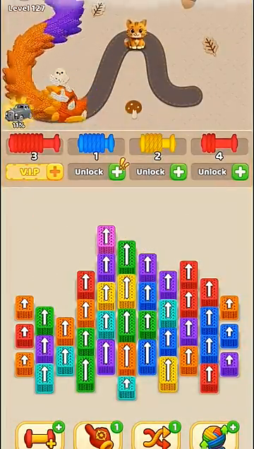
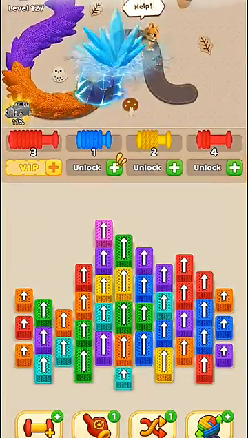
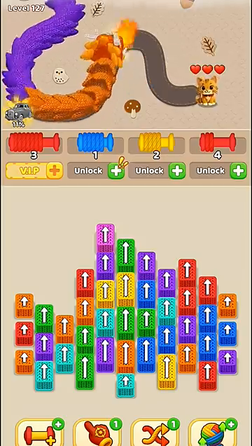
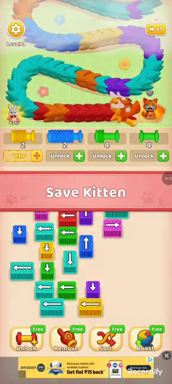
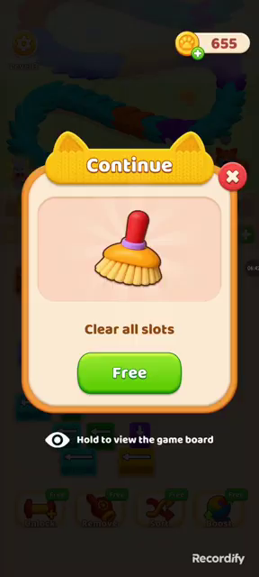
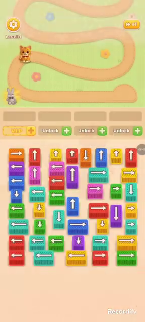
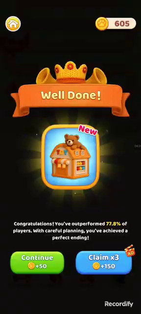
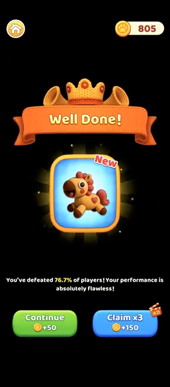
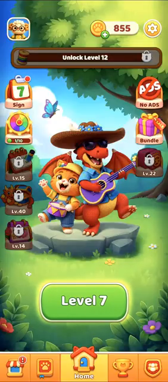
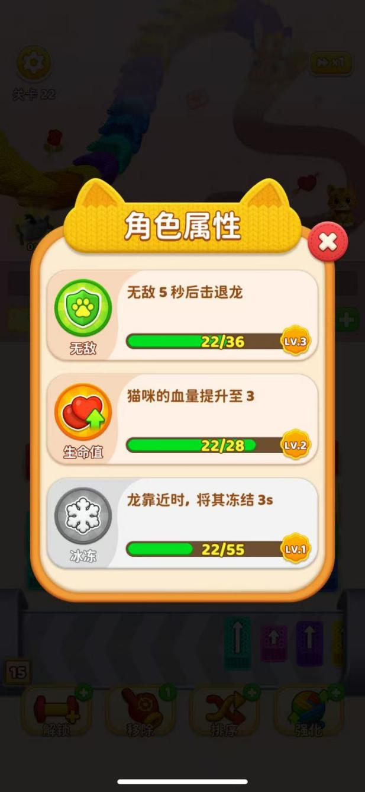

# 털실 마스터 원본 조사와 현재 구현의 차이

조사 기준일: 2026-09-10. 대상은 Android 패키지 `wool.match.color.sort.jam.puzzle`, Apple 앱 ID `6743385713`인 **털실 마스터 / Wool Crush**다. 현재 공식 제공자는 Astrasen Global이다. 제목이 비슷한 Wool Craze 등의 자료는 합치지 않았다. [Google Play](https://play.google.com/store/apps/details?id=wool.match.color.sort.jam.puzzle&hl=en), [App Store](https://apps.apple.com/gb/app/wool-crush-bus-knit-away-jam/id6743385713?platform=ipad)

**현재 결과물은 일부 장면을 재현한 시제품이며, 원본의 한 판 전체와 장기 진행을 재현한 게임으로 평가할 수 없다.** 외형을 다듬는 동안 피격, 고양이 능력, 실패 후 선택, 일반 클리어 보상, 다음 레벨의 변화가 검증 범위에서 빠졌다. 이 보고서는 기존 구현을 정당화하는 문서가 아니라, 어디가 관찰과 다르고 어디는 아직 모르는지 정리한 조사 결과다. 조사 중 게임 코드와 배포 파일 수정은 중단했다.

**근거를 읽는 방법**

| 표시 | 의미 | 사용할 수 있는 범위 |
|---|---|---|
| 화면 확인 | 원본 영상의 해당 시각 프레임과 앞뒤 상태를 확인 | 그 장면에 보이는 동작·화면. 영상에 없는 내부 수치나 원인까지 확정하지 않음 |
| 공식 설명 | 스토어, 버전 이력, 공식 이벤트의 설명 | 기능 존재와 공식 안내. 모든 계정·버전에서 같은 순서·수치라는 뜻은 아님 |
| 체험 보고 | 다른 작성자의 실제 플레이 분석 | 교차 확인할 단서. 직접 관찰한 것과 분리 |
| 미확인 | 자료가 없거나 구분할 수 없음 | 구현값으로 확정하지 않음 |
| 개선 판단 | 이번 조사와 사용자 피드백으로 도출한 제안 | 원본의 사실이 아니라 우리 게임에 대한 판단 |

자료를 많이 찾은 것과 많이 검증한 것은 구분했다. 새로운 YouTube 플레이 영상 5편을 확보했으며, 개요 프레임과 필요한 전후 구간을 조사했다. 전체 영상의 모든 프레임·소리를 빠짐없이 감상했다는 뜻은 아니다. 기존 V01과 주소만 다른 영상 한 개는 SHA-256이 같아 새로운 근거에서 제외했다. 공식 이미지도 실제 플레이 UI와 홍보용 합성 장면을 구분했다. 세부 출처와 관찰 범위는 [출처 목록](../Evidence/Research/2026-09-10/sources.json)에 남겼다.

## 1. 사용자가 지적한 부분에 대한 현재 답

| 지적 | 조사 결과 | 현재 구현에 대한 판정 |
|---|---|---|
| 용이 고양이에 닿을 때 어떻게 되는가 | 고양이의 도주, 용의 화염, 보호·동결 효과, 별도의 격퇴가 관찰된다. 이들을 한 가지 충돌 반동으로 묶을 수 없다 | 고양이 고정 + 하트 감소 + 용 190px 후퇴는 근거가 부족하다 |
| 목숨이 깎이는 것을 제대로 반영했는가 | 초반 영상에는 1하트, 후반 영상에는 3하트가 보인다. 성장 화면에도 생명력 능력이 있다. 정확한 공격 판정·감소 시점·회복 수치는 추가 확인 필요 | 모든 판을 3하트로 시작하는 현재 규칙도 원본 공통 규칙으로 검증되지 않았다 |
| 클리어 뒤 어떻게 이어지는가 | 일반 플레이에서 결과·보상 선택·다음 레벨 진입이 확인된다. 공식 자료에는 카드 수집과 이벤트 진행도 있다 | 세 판 순환과 다음 버튼만으로는 부족하다 |
| 위 이동 영역과 아래 블록 영역 비율 | 두 개의 전체 플레이 화면을 같은 기준으로 재면 위 약 36~37%, 중간 약 10~12%, 아래 보드 약 42~44%다. 다른 편집 영상에서는 비율이 달라진다 | 한 장면의 비율을 모든 스테이지·기기로 일반화하면 안 된다 |
| 실 뭉치 방향과 구획 구분 | 실제 플레이의 대기 선반은 가로 방향 실감개가 좌우로 배치된다. 위 경로, 중간 선반, 아래 보드는 경계와 재질·색으로 구별된다 | 가로 배치는 유지하고, 원본 장면과 경계·여백·크기를 함께 비교해야 한다 |
| 실이 용에 연결될 때 효과가 약하다 | 새 영상에서도 연결선, 몸통 감소, 실감개 감김·수량 변화, 완료 슬롯의 발광이 함께 보인다 | 접점에 빛 하나를 더하는 것만으로 수집 감각 전체가 해결되지는 않는다 |
| VIP 옆 해제 글자 정렬 | 글자 공간과 오른쪽 + 버튼을 나누어 중심을 봐야 한다 | 기존 피드백 수정은 소스에만 있으며 이번 조사 뒤 검토 전까지 새 빌드로 배포하지 않았다 |
| 캐릭터 생김새 | 사용자가 현재 고양이·용 외형을 수용했다 | 외형 전면 재제작보다 행동·상태 표현을 먼저 바로잡는 편이 타당하다 |

위 표의 사실 근거는 아래 장면 기록에 연결되어 있다. 특히 ‘피격 확인’과 ‘정확한 HP 감소 규칙 확인’은 같은 말이 아니다.

## 2. 피격을 한 가지 이벤트로 단순화하면 안 되는 이유

기존 V01의 36.5~38.75초에서는 고양이가 오른쪽 굽이를 따라 아래 구간으로 달린 뒤 다른 위치에 정지한다. 용은 따라 전진한다. 이동 전 하트가 선명하지 않으므로 이를 곧바로 ‘하트가 하나 감소한 장면’이라고 부를 수는 없다. 51초에는 별도 격퇴 안내가, 54~55초에는 용이 뒤로 밀리는 장면이 나온다. **도주와 격퇴는 구분되는 행동이다.** [V01 원본](https://www.baijing.cn/ueditor/php/upload/video/20260803/1785739788319382.mp4), [독립 검토 프레임](../Evidence/Research/2026-09-10/frames/)

다른 시기의 Movie Night Gaming 영상 04:06~04:08에서도 화염과 고양이의 경로 이동, 이동 뒤의 1하트 표시를 독립 검토자가 확인했다. 여기서도 이전 하트가 보이지 않아 2→1 감소라고 단정하지 않았다. 도주는 기존 한 영상에만 의존한 관찰이 아니다. [Movie Night Gaming, 2025-10-24](https://www.youtube.com/watch?v=NM9-sUw9pu8&t=246s)

새로 확인한 127레벨 영상에서는 5초에 용이 몸을 굽히고, 6초에 큰 얼음 결정과 도움 요청 표시가 나타나며, 7초에는 고양이가 새로운 경로 끝에서 3하트로 서 있다. 이 화면은 고양이가 위치를 바꾸고 방어 효과가 개입한다는 증거다. 이 짧은 편집 영상의 재생 초수를 원본의 실제 스킬 지속시간으로 사용해서는 안 된다. [Go2 Next Level, 2026-04-05, 00:05~00:07](https://www.youtube.com/watch?v=yx5iKjCEx7M&t=5s)

| 00:05 | 00:06 | 00:07 |
|---|---|---|
|  |  |  |

다른 체험자의 분석도 고양이 방어 속성이 레벨 진행으로 성장한다고 설명한다. 다만 그 글의 ‘앞으로 영웅 성장으로 확장할 수 있다’는 의견을 이미 구현된 기능으로 읽으면 안 된다. [Zach Jiang의 직접 플레이 분석, 2026-04-17](https://www.linkedin.com/pulse/save-cat-meow-wool-crush-zach-jiang-%E8%92%8B%E6%96%87%E8%B6%85-coj9c)

현재 코드에서는 경로 끝 85px 전이라는 조건을 넘으면 하트를 줄이고, 남아 있으면 용의 진행 거리를 190px 감소시킨다. 고양이는 고정 좌표에 있으며 도주 목적지·방어 상태·공격 단계가 없다. 따라서 이 코드를 테스트해 ‘하트가 줄었다’고 확인해도 원본 피격을 검증한 것이 아니다. [현재 규칙](../Rebuild/scripts/state.gd), [고양이 고정 위치](../Rebuild/scripts/layout.gd)

**개선 판단:** 다음 구현의 단위는 ‘피격 효과 추가’가 아니라 접근 → 예고 → 고양이 이동 또는 방어 → 공격 결과 → 계속 추격/실패의 연결이어야 한다. 그렇다고 이 순서가 항상 동일하다고 먼저 확정해서도 안 된다. 성장 전후, 도주할 공간이 남은 경우와 마지막 위치, 방어 효과가 있는 경우를 나눠 근거를 적용해야 한다.

## 3. 실패, 이어하기, 재도전과 정상 클리어

새 GamingLebra 영상의 3레벨에서는 04:30에 1하트인 고양이 가까이 용이 접근하고, 04:35~04:40에는 고양이 둘레의 푸른 원형 효과·화염·붉은 위험 표시가 보인다. 원형 효과는 보호 상태로 보이지만 이 장면만으로 상태명을 확정하지 않았다. 04:42에는 **슬롯을 비운다고 안내하는 이어하기 제안**, 04:43~04:44에는 실패·재도전 화면, 04:46에는 같은 3레벨의 0% 상태가 나온다. 이 구간은 제안을 닫고 재시작하는 경로를 보여 준다. 이어하기를 선택했을 때 하트·용 위치·진행률이 어떻게 복원되는지는 확인되지 않았다. [GamingLebra, 2026-04-06, 04:30~04:46](https://www.youtube.com/watch?v=HR-0KwTL8dA&t=270s)

| 위험 상태 04:40 | 이어하기 제안 04:42 | 재시작 04:46 |
|---|---|---|
|  |  |  |

[실패·재도전 화면의 정확한 프레임: 04:43.5](../Evidence/Research/2026-09-10/N3-283.5s.png)

같은 영상의 정상 클리어에서는 02:24에 집 모양의 새 수집물과 기본 +50 / 광고 표시가 붙은 3배 +150 선택이 나타난다. 이어 코인 연출이 나오고 다음 3레벨이 시작된다. **50이라는 수치는 그 장면의 보상**이며 모든 레벨의 고정 보상으로 일반화할 수 없다. 화면의 다른 플레이어 대비 퍼센트도 계산 방법이 검증되지 않았으므로 실제 성과 통계로 쓰지 않는다. [02:24~02:30](https://www.youtube.com/watch?v=HR-0KwTL8dA&t=144s)

또 다른 채널의 33분 영상에서는 17:35~17:50 구간에 6레벨 결산과 새 수집품·보상 선택, **홈 화면**, 7레벨 진입이 이어진다. 보상 선택 화면의 805코인은 홈에서 855코인이 된다. 홈에는 큰 다음 레벨 버튼, 하단 탐색 탭, 레벨 조건으로 잠긴 콘텐츠가 보인다. 따라서 일반 클리어 뒤 흐름을 ‘항상 즉시 다음 레벨’이라고 단정해서도 안 된다. 두 영상의 차이가 버전·레벨·사용자 선택 중 무엇 때문인지는 확정하지 않았다. [Crazzzy Games Walkthrough, 2026-02-23, 17:35~17:50](https://www.youtube.com/watch?v=LjF8rB4lGig&t=1055s)

| 보상 선택 17:41 | 홈 17:42 |
|---|---|
|  |  |

현재 구현은 패배 시 재시작과 클리어 후 다음 버튼을 제공한다. 다음 레벨 인덱스는 세 개의 데이터 안에서 순환한다. 승리 직후 완료 사실·획득 보상·해금 상태를 저장하는 구조도 없다. [현재 진행 처리](../Rebuild/scripts/game.gd)

**개선 판단:** 최소한 한 판 성공 → 결과 확인 → 보상 확정 → 다음 판 시작 → 종료·재실행 후 진행 유지까지 연결되어야 ‘클리어 이후를 만들었다’고 말할 수 있다. 원본과의 충실도를 판단할 때는 결과 화면의 외형뿐 아니라, 무엇을 얻었고 다음 판에서 무엇이 달라졌는지까지 봐야 한다. 광고나 결제를 실제로 도입하는 것은 별도의 제품 결정이며 이번 조사로 자동 결정되지 않는다.

## 4. 도구, 고양이 성장, 스테이지 변화

4월의 실제 체험 기사와 첨부 성장 화면은 일반 도구와 고양이 능력을 구분한다. 도구는 슬롯 추가, 아래 블록 제거, 용의 색 순서 정렬, 강화다. 강화는 안개를 걷고 화면 밖 실도 수집 가능하게 한다고 보고되어 있다. 성장 화면에는 무적 후 격퇴, 생명력 증가, 접근 시 동결이 별도 항목으로 나온다. 표시된 5초·3초와 성장 진도는 **해당 화면의 버전·성장 단계에 한정**된다. [白鲸出海 체험 기사와 원본 화면, 2026-04-03](https://www.baijing.cn/article/55125)

같은 매체의 별도 16레벨 시연에서는 두 마리 용, 두 하트, 대각선 블록, 숫자가 붙은 어두운 블록, 강화 카운트다운을 볼 수 있다. 후반에는 안개와 위험 테두리, 보호 상태 표시가 나타난다. 숫자 블록이 정확히 어떤 규칙으로 열리는지, 두 용의 목표·피해 처리가 공유되는지는 이 짧은 시연만으로 확정할 수 없다. [강화 시연 원본, 약 25초](https://www.baijing.cn/ueditor/php/upload/video/20260403/1775218300960604.mp4)

| 비교 항목 | 직접 확인된 변화 | 아직 확정하면 안 되는 부분 |
|---|---|---|
| 경로 | 기존 41레벨의 겨울 굽이, 새 127레벨의 산 모양 경로, 296레벨의 다른 굴곡 | 전 레벨 공통 경로 목록과 생성 알고리즘 |
| 블록 | 127레벨의 계단형 배열, 296레벨의 여러 방향이 섞인 배열, 16레벨의 대각선 | 전체 블록 종류·해금 레벨·해답 개수 |
| 용 | 단일 용과 두 용 시연 | 두 용의 체력·색 배분·동시 공격 규칙 |
| 시야 | 화면 상단 안개와 그 아래 노출된 몸통 | 안개 경계의 정확한 충돌·수집 판정식 |
| 슬롯 | 가로 실감개, 남은 양의 숫자, 완료 시 빈자리와 발광 | VIP 지속시간, 슬롯 추가가 다음 판까지 유지되는 조건 |
| 성장 | 서로 다른 하트 표시와 별도 능력 UI | 모든 성장 단계의 수치와 경험치 계산식 |

127레벨은 전체 클리어가 나오지 않는 짧은 영상이다. 296레벨 영상도 마지막 확인 장면이 97%이고 이후 검은 화면으로 끝나므로 클리어 근거에서는 제외했다. 둘 다 실제 동일한 게임 UI임을 확인했지만, ‘공략’이라는 제목만으로 완주·정답 경로를 인정하지 않았다. [127레벨](https://www.youtube.com/watch?v=yx5iKjCEx7M), [296레벨, Just Play Games, 2026-04-24](https://www.youtube.com/watch?v=RRseHlTBPis)

현재 강화는 화면 밖 몸통을 여전히 제외하고, 고정된 화면 내 영역의 제한을 푸는 방식이다. 아래 블록 제거도 정상 수집 경로로 보내는 자체 동작이다. 같은 이름의 버튼이 존재한다는 것만으로 원본 도구가 구현되었다고 판정할 수 없다. [도구·수집 규칙](../Rebuild/scripts/state.gd)

**개선 판단:** 스테이지 차이는 색과 블록 개수만 늘리는 문제가 아니다. 출구 방향, 필요한 색이 드러나는 순서, 실감개 용량, 용의 접근 여유, 시야 제한, 방어 능력이 함께 달라진다. 한 요소를 변경할 때 실제 선택이 어떻게 달라지는지를 플레이로 확인해야 한다.

## 5. 클리어 이후에는 무엇이 남는가

공식 Home Collection 안내는 스테이지 완료로 카드를 얻고 고양이 Woolo와 용 Crushpyr의 수집품을 모으며, 수집 화면에서 언제든 확인할 수 있다고 설명한다. **완료 기록과 별개로 축적되는 수집 진행이 존재한다.** 실제 카드 획득 빈도·중복 처리·앨범 완성 보상은 공식 설명만으로 알 수 없다. [공식 Home Collection 안내](https://play.google.com/store/apps/eventdetails/4830473752881186444)

App Store 이력에는 2026년 3월 25일 팀·순위표 개선, 4월 17일 난이도 조정, 6월 26일과 7월 25일 신규 레벨 추가가 기록되어 있다. 별도 공식 보물 탐색 이벤트는 레벨을 완료해 섬의 보물상자를 여는 흐름을 소개한다. 공개 설명만으로 팀 협력의 구체적 보상이나 이벤트 진도 수치를 만들 수는 없다. [공식 버전 이력](https://apps.apple.com/gb/app/wool-crush-bus-knit-away-jam/id6743385713?platform=ipad), [공식 보물 탐색 이벤트](https://apps.apple.com/gb/app/wool-crush-bus-knit-away-jam/id6743385713?eventid=6799881700)

장기 진행을 제품 관점에서 나누면 다음과 같다. 이는 서로 다른 자료에서 확인한 기능의 관계를 정리한 것이며, 화면이 반드시 이 순서로 열린다는 의미는 아니다.

| 층위 | 플레이어가 느끼는 변화 | 근거 상태 | 현재 시제품 |
|---|---|---|---|
| 판 안의 진행 | 용을 풀고 고양이를 지킴 | 직접 확인 | 부분 구현 |
| 판의 결산 | 성공/실패를 이해하고 보상을 선택 | 새 영상에서 확인 | 간단한 배너·버튼 |
| 스테이지 진행 | 다음 구조와 제약을 만남 | 새 영상·공식 업데이트 | 세 데이터 순환 |
| 고양이 성장 | 위험을 견디는 방식이 달라짐 | 성장 화면·새 영상 | 없음 |
| 수집 | 얻은 것을 쌓고 다시 봄 | 공식 안내·보상 화면 | 없음 |
| 팀·순위·이벤트 | 장기 목표와 비교·공동 활동 | 기능 존재 공식 확인 | 없음 |

**개선 판단:** 먼저 결산과 영속 진행을 완성해야 한다. 그다음 어떤 스테이지 변화와 고양이 성장을 보여 줄지 정한다. 팀·순위·이벤트를 한꺼번에 추가해 핵심 플레이 검증을 미루는 것은 현재 문제를 해결하지 못한다. 반대로 핵심 한 판만 만든 뒤 원본 전체 흐름이 완성됐다고 보고해서도 안 된다.

## 6. 화면 비율, 재질 구분, 수집 효과

비율은 ‘원본 이미지 전체 높이’가 아니라 **광고와 OS 영역을 제외한 실제 플레이 높이**를 분모로 비교했다. 위 구간에는 HUD와 경로를 포함하고, 중간은 실감개와 해제 버튼, 보드는 그 아래 여백과 블록, 맨 아래는 도구 줄이다. 경계는 프레임에서 수동으로 읽은 근삿값이므로 수 px 오차가 있다.

| 화면 | 플레이 높이 | 위 경로·HUD | 중간 선반 | 보드·여백 | 도구 줄 |
|---|---:|---:|---:|---:|---:|
| 기존 V04 00:00, 592×1280 | 약 1138px | 420px / 36.9% | 133px / 11.7% | 475px / 41.7% | 110px / 9.7% |
| 신규 N3 02:20, 288×640 | 약 594px | 216px / 36.4% | 61px / 10.3% | 263px / 44.3% | 54px / 9.1% |

첫 행은 [V04 화면](../Wool_Crush_Design/crush_references/V04_clear_000.0s.png), 둘째 행은 [새 일반 플레이 화면](../Evidence/Research/2026-09-10/N3-140s.png)에 대한 관찰이다. 편집된 127레벨 프레임은 위 구간이 약 29%로 더 작다. 촬영·크롭·게임 버전·기기 차이를 제거하지 못했으므로 그 값을 새 표준으로 삼지 않았다. **‘원본은 항상 이 비율’이라는 결론은 내릴 수 없다.**

또한 보드 영역 높이와 남은 블록 덩어리 높이는 다르다. 기존 V04는 이미 76% 진행된 장면이다. 그때의 작은 잔여 블록과 넓은 여백을 레벨 시작 화면의 정답처럼 복제하면 실제 원본과 다른 인상을 줄 수 있다. 시작·중간·위기·마무리를 같은 진행률끼리 비교해야 한다.

공식 스토어 갤러리에는 게임 화면과 다른 홍보 구도가 섞여 있다. 예를 들어 별 모양으로 감긴 용이 보드 사이로 크게 내려오는 장면과 옷 입은 캐릭터의 홍보 일러스트가 있다. **공식 이미지라는 이유만으로 플레이 영역이나 버튼 규격의 기준으로 삼지 않았다.** [공식 갤러리](https://play.google.com/store/apps/details?id=wool.match.color.sort.jam.puzzle&hl=en), [확인한 이미지와 원본 주소](../Evidence/Research/2026-09-10/store-images.json)

수집 효과는 네 위치에서 연결되어 보여야 한다는 것이 이번 관찰에 따른 개선 판단이다.

| 위치 | 사용자가 읽어야 하는 것 | 검토할 장면 |
|---|---|---|
| 선택한 블록 | 내가 누른 물체가 어느 자리로 갔는가 | 막힌 블록, 빈 슬롯, 이동 완료 |
| 용의 수집 지점 | 어느 색·어느 몸통이 풀리는가 | 시작 접점, 수집 중, 마지막 한 단위 |
| 연결된 실 | 용과 실감개가 실제로 이어졌는가 | 카메라 기준 위치, 굽은 선의 움직임, 여러 선이 겹칠 때 |
| 실감개·슬롯 | 얼마나 감겼고 언제 자리가 비는가 | 남은 양 감소, 완료 발광, 빈자리 복귀 |

새 127레벨의 00:18에는 화염과 함께 완료 슬롯의 노란 발광이 보인다. 따라서 수집 성공·위험·방어 효과를 같은 색 번쩍임으로 처리하면 무엇이 일어났는지 읽기 어렵다. 색, 위치, 크기, 지속시간이 각각의 의미를 전달해야 한다. [00:18 프레임](../Evidence/Research/2026-09-10/yx5iKjCEx7M-18s.png)

현재 사용자가 수용한 고양이·용 외형은 유지할 가치가 있다. 우선순위는 새로운 얼굴을 만드는 것이 아니라, 그 캐릭터가 도망가고 버티고 위험해지고 구조되는 모습을 믿을 수 있게 만드는 것이다. 해제 글자 정렬은 정상·눌림·비활성 상태와 작은 화면에서도 확인해야 한다. 연결 효과 역시 멈춘 스크린샷에서 예쁜지보다 플레이 중 눈으로 추적되는지가 중요하다.

## 7. 실제 사용자가 좋아한 것과 불편해한 것

공식 스토어 리뷰에는 실을 풀어내는 감각을 좋아한다는 반응과 함께, 광고 빈도·작은 닫기 버튼·보상 광고 뒤 진행 문제·반복되는 판에 대한 불만이 나온다. 이는 선택된 리뷰의 경험이며 전체 사용자의 비율이나 특정 레벨이 수학적으로 불가능하다는 증거는 아니다. 개발자 답변도 문제를 검토한다는 수준이므로 해결 완료로 해석하지 않았다. [Google Play의 실제 리뷰와 답변](https://play.google.com/store/apps/details?id=wool.match.color.sort.jam.puzzle&hl=en)

독립 체험자는 제한된 슬롯과 빠른 용의 접근이 압박을 만든다고 설명한다. 이 구조는 편안한 색 정렬과 고양이 구조의 긴장감을 함께 만든다는 점에서 참고할 만하다. 광고를 더 보도록 하는 것이 곧 좋은 난이도라는 결론은 아니다. [Zach Jiang의 체험 분석](https://www.linkedin.com/pulse/save-cat-meow-wool-crush-zach-jiang-%E8%92%8B%E6%96%87%E8%B6%85-coj9c)

우리 게임의 정성 평가에서는 다음을 실제 플레이어의 반응으로 판단해야 한다.

| 순간 | 기대하는 반응 | 실패 신호 |
|---|---|---|
| 첫 몇 번의 선택 | “색만 맞추는 게 아니라 나갈 방향도 봐야 하네” | 무엇을 눌러도 되는지 모르거나 효과 없이 막힘 |
| 실 수집 | “저 부분이 풀려서 여기로 감기는구나” | 선이 장식처럼 보이고 어느 물체가 줄었는지 모름 |
| 첫 위기 | “고양이가 위험하다, 지금 바꿔야겠다” | 멀리 있는데 갑자기 하트가 줄거나 이유 없이 용이 뒤로 감 |
| 실패 | “어디서 잘못했는지 알겠다, 다시 해보자” | 억울함, 복구 조건을 모름, 진행이 사라짐 |
| 클리어 | “구했다, 무언가 얻었다” | 화면만 바뀌고 구조한 느낌이나 보상이 없음 |
| 다음 판 | “다른 판단이 필요하네” | 같은 판의 색만 바꾼 느낌 |

이 표는 원본의 정답 수치가 아니다. 사용자 평가를 작업 중에 확인하기 위한 질문이다. 테스트가 모두 통과해도 이 반응이 나오지 않으면 게임의 개선이 끝난 것이 아니다.

## 8. 지금의 실패를 만든 방법상의 원인

**늦은 한 장면을 전체 게임의 대표로 삼았다.** 41레벨의 76% 장면은 재질·비율 비교에는 쓸 수 있지만, 처음부터 한 판을 운영하는 규칙이나 고양이 성장·난이도 설계의 대표가 될 수 없다.

**관찰하지 못한 빈칸을 임의의 규칙으로 채웠다.** 고정 3하트, 경로 끝 임계점, 매번 190px 후퇴, 고양이 고정은 내부적으로 동작한다. 그러나 원본 영상의 도주·방어·격퇴를 설명하지 못한다.

**동작 테스트와 원본 검증을 혼동했다.** 현재 코드의 기대값대로 실행되는지 확인하는 테스트는 버그를 찾는다. 기대값 자체가 원본과 다른지는 별도의 관찰과 리뷰가 필요하다.

**끝나는 장면 이후를 제품 범위에서 놓쳤다.** 승리 배너가 나오면 시연은 끝날 수 있다. 사용자는 결과를 받고 다음 판을 시작하며 나중에 다시 돌아온다. 이 사이가 비어 있었다.

**정지 외형과 움직임의 역할을 따로 보았다.** 귀여운 얼굴과 니트 질감만으로 구조 게임이 성립하지 않는다. 고양이가 왜 도망가고 용이 언제 위협하며 내가 어떻게 막았는지가 보여야 한다.

## 9. 조사 결과를 다음 작업에 적용하는 순서

아래는 구현을 재개할 때의 제안이다. 이번 조사 중 확정되지 않은 수치를 넣어 코드를 변경하지 않았다.

1. **한 판의 행동부터 재설계한다.** 도주 위치, 공격·방어·피해·격퇴를 분리하고, 원본에서 확인한 상황마다 전후 상태를 연결한다. 미확인 수치는 임의의 ‘원본값’으로 붙이지 않는다.
2. **성공·실패 이후를 연결한다.** 결과, 보상 확정, 재시도와 이어하기의 차이, 다음 스테이지, 저장과 재접속을 하나의 사용자 흐름으로 검토한다.
3. **서로 다른 판단을 요구하는 스테이지 묶음을 만든다.** 단일 경로·단순 출구, 방향 혼합, 시야 제한, 방어 능력 개입, 복수 위협처럼 조사된 차이를 적용한다. 정확한 원본 레벨 복제와 자체 레벨 설계는 구분한다.
4. **이동과 수집의 읽힘을 다듬는다.** 현재 수용된 캐릭터를 바탕으로 도주·위험·방어·수집 완료를 구별하고, 시작/중간/위기/클리어의 화면 구도를 함께 비교한다.
5. **독립 리뷰로 다시 본다.** 구현한 사람의 설명 없이 원본과 결과물을 같은 상황으로 비교한다. 규칙 차이와 사용자가 느끼는 차이를 모두 보고, 근거가 없는 항목은 통과시키지 않는다.

이 순서는 문서 달성률을 높이기 위한 절차가 아니다. 첫 단계부터 실제 플레이를 보고, 고양이가 위험하게 느껴지는지, 수집이 만족스러운지, 실패가 납득되는지를 확인하면서 설계를 수정해야 한다.

## 10. 남아 있는 조사 공백

| 미확인 항목 | 현재 공개 자료로 말할 수 있는 한계 | 필요한 다음 증거 |
|---|---|---|
| 정확한 HP 감소 | 위험·화염·보호·실패는 보이나 모든 단계의 숫자 변화가 선명하지 않음 | 성장 단계별 첫 공격부터 다음 추격까지 연속 녹화 |
| 도주 판정 | 위치 이동은 확인, 실제 물리 접촉/거리/경로 지점 중 무엇이 트리거인지는 미확인 | 같은 경로에서 속도·상태가 다른 반복 장면 |
| 부활 후 복구 | 제안 화면과 닫고 재시도하는 경로만 확인 | 제안을 실제 수락한 뒤 HP·슬롯·용 위치·진행률 비교 |
| 실패 원인 종류 | 위기 장면에서 슬롯도 가득 차 있어 각 원인을 분리할 필요 | 여유 슬롯인데 피격 실패, HP 여유인데 슬롯 막힘 사례 |
| 도구 세부 규칙 | 이름·효과 개요와 일부 시연 확인 | 사용 전후 같은 화면, 종료 직후, 화면 밖 대상 포함 여부 |
| 성장 표 | 특정 단계 화면만 확보 | 능력 해금 전후와 연속 성장 단계 |
| 카드·팀·이벤트 | 공식 존재 확인 | 실제 진입·획득·완료·보상 흐름 |
| 반복 플레이 | 서로 다른 레벨 확인 | 같은 레벨 재도전 시 고정/재배치 범위 확인 |
| 저장 | 우리 구현은 확인했지만 원본의 저장 시점은 미확인 | 결과 확정 전후 앱 종료·복귀 관찰 |
| 소리·진동 | 이번 조사에서는 정밀 검토하지 않음 | 기기에서 수집·공격·방어·클리어를 구분해 청취·확인 |

## 출처와 제외한 자료

공식 자료는 위 링크를 본문 근거로 사용했다. Google Play 페이지는 2026-09-03 업데이트를 표시했고, 가져온 App Store 본문은 5.1 / 8월 21일을 표시했다. 검색 요약에 다른 버전이 나타나기도 하므로 공개 캐시만으로 지역별 최신 버전을 동일하다고 단정하지 않았다. 영상 업로드 날짜는 촬영 날짜·앱 버전과 같지 않을 수 있다.

| ID | 자료 | 게시일 / 범위 | 사용 목적 |
|---|---|---|---|
| N1 | [Movie Night Gaming — Level 1–2–3](https://www.youtube.com/watch?v=NM9-sUw9pu8) | 2025-10-24, 5:12 | 독립 검토자의 초반 흐름 조사 |
| N2 | [Crazzzy Games Walkthrough — Level 1–10](https://www.youtube.com/watch?v=LjF8rB4lGig) | 2026-02-23, 33:45 | 독립 검토자의 초기 스테이지·결과 흐름 조사 |
| N3 | [GamingLebra — FULL WALKTHROUGH](https://www.youtube.com/watch?v=HR-0KwTL8dA) | 2026-04-06, 16:33 | 직접 확인한 일반 보상·실패·재시도. 제목의 ‘전체’ 주장은 채택하지 않음 |
| N4 | [Go2 Next Level — Level 127](https://www.youtube.com/watch?v=yx5iKjCEx7M) | 2026-04-05, 0:47 | 경로·배치·동결·도주. 클리어 미포함 |
| N5 | [Just Play Games — Level 296](https://www.youtube.com/watch?v=RRseHlTBPis) | 2026-04-24, 3:53 | 테마·방향 혼합·후반 플레이. 97% 뒤 종료 |
| B1 | [白鲸出海의 강화 시연](https://www.baijing.cn/ueditor/php/upload/video/20260403/1775218300960604.mp4) | 기사 2026-04-03, 0:25 | 두 용·강화·방어 상태. 편집 시연 |
| P1 | [白鲸出海 체험 기사](https://www.baijing.cn/article/55125) | 2026-04-03 | 도구 개요·고양이 성장 화면 |
| P2 | [Zach Jiang의 체험 분석](https://www.linkedin.com/pulse/save-cat-meow-wool-crush-zach-jiang-%E8%92%8B%E6%96%87%E8%B6%85-coj9c) | 2026-04-17 | 성장·긴장감에 대한 교차 확인 |

LevelSolve는 원본 YouTube 영상 주소를 찾는 데만 사용했다. 127레벨 설명에는 3색 표기와 다른 색의 지시가 섞이고 ‘3개 매칭’이라는 설명도 있어 규칙 근거에서 제외했다. Tap Guides의 보스·폭탄·한정 이동 수 설명 역시 이번에 확인한 화면으로 입증되지 않아 채택하지 않았다. 한국어 쿠폰 검색 결과 중 다른 게임의 디지몬 보상을 적거나 외부 가입으로 유도하는 글도 제외했다. [LevelSolve 해당 페이지](https://levelsolve.com/wool-crush/level/127/), [Tap Guides 예시](https://tap-guides.com/2025/09/27/wool-crush-level-11-20-guide/), [동일 게임으로 인정하지 않은 쿠폰 글](https://you1780.tistory.com/192)

원본 영상을 내려받은 파일과 관찰 프레임은 [조사 증거 폴더](../Evidence/Research/2026-09-10/)에 있으며, N1~N3 원본은 [원본 영상 출처 목록](../Evidence/Research/2026-09-10/sources.json)에 있다. 이 보고서의 미확인 항목을 해결하지 않은 채 원본 전체를 조사·구현 완료했다고 보고하지 않는다.

[독립 조사·보고서 검토 기록](../Evidence/Research/2026-09-10/INDEPENDENT_RESEARCH_REVIEW.md)에는 실제 검토 범위와 반론을 남겼다. 실패 화면의 시각과 방어 효과의 확정 표현을 수정했고, 다른 채널의 도주 및 홈 경유 사례를 추가했다. 이 검토는 게임 전체의 동일성 판정이 아니다.
