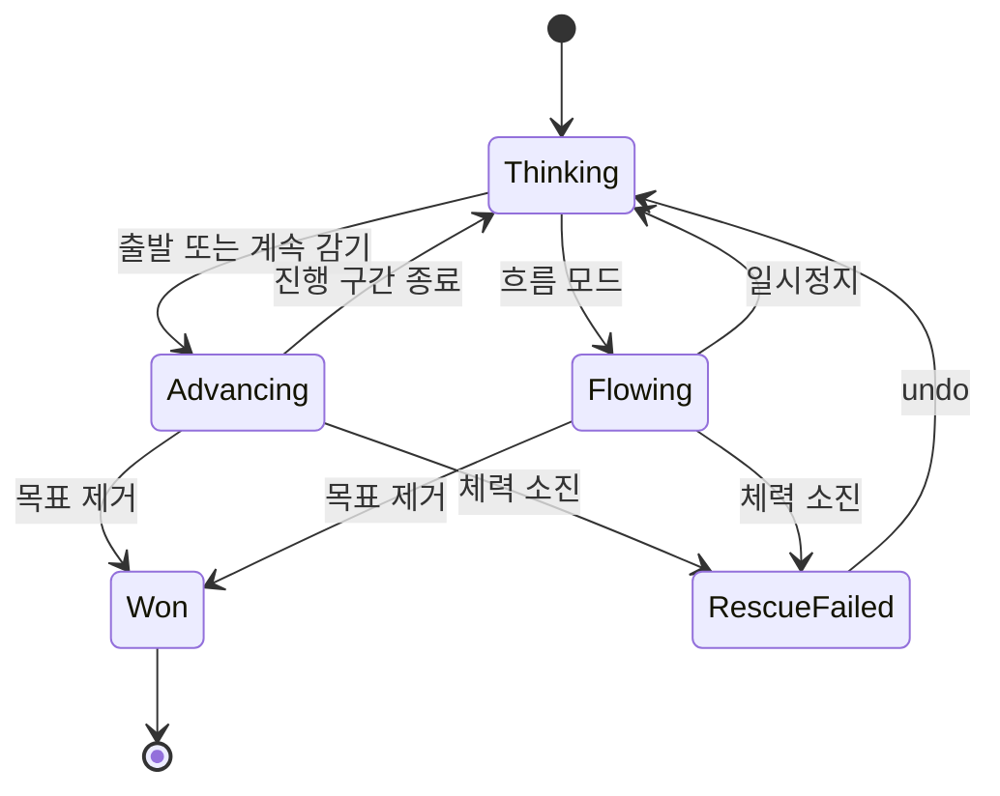

# 털실 마스터 기반 플레이 사양

2026-09-08 / 규칙 ID **cozy-rescue-v1**. 이전 cozy-orders-v1은 사용하지 않는다.

## Reference behavior: Wool Crush / 털실 마스터

관찰 범위는 01·11에 한정한다. 하단 방향 블록 → 중앙 실타래 → 같은 색 몸통 수집 → 수용량 충족 시 자리 회수가 보인다. 가로 작업 자리 4개, 시연의 용량 4/6/10, 숫자 감소, 안개와 기간제 강화, 복수 용, 자리 부족 후에도 계속되는 플레이를 관찰했다. 전 버전 공통값, 타깃 우선순위, 모든 충돌, 숨은 공급 큐, 정확한 체력/승리 판정은 미확정이다.

매치 3개·주문 2개·별도 buffer 5칸·3D 물체 회전·그림 완성은 채택하지 않는다.

## Proposed behavior: our game

이하 전부 **우리 게임의 설계 결정**이다. 가칭 **솜길 구조대**. 하단 방향 블록, 제한된 실타래, 움직이는 포근한 생물을 유지한다. 독자 디자인의 솜구름 용과 크림색 고양이를 사용한다.

### 1. 플레이 리듬

| 모드 | 진행 | 퍼즐 압박 |
|---|---|---|
| 생각 모드 — 기본 | 판단 중 논리 시간 정지. 출발 후 12 tick 진행하고 정지. ‘계속 감기’로 시간을 진행 | 자리·노출 색·탈출 순서는 그대로. 시간 전진 시 접근 위험 증가 |
| 흐름 모드 | 동일 Core를 실시간 진행. 무료 일시정지. wall-clock 배속 0.65부터 조정 | 원작에 가까운 접근 긴장감 |

생각 모드에서도 무제한 공짜 기다리기는 없다. ‘계속 감기’는 논리 시간을 진행시키므로 필요한 색을 기다리는 동안 용이 접근한다. 앱 전환·설정·힌트 계산 시 정지한다. 원작과 같은 기능이라는 주장이 아닌 편안함을 위한 변경이다.

### 2. 상태 계약

| 데이터 | 필드·책임 |
|---|---|
| Block | id, colorId, capacity, footprint, escapeDirection, Board/Reserved/InTransit/Working/Finished |
| WorkSlot | slotIndex, assignedBlockId 또는 empty, remainingCapacity |
| YarnUnit | id, colorId, chainId, 원래 순서, remaining/consumed |
| Chain | 머리 위치 q, 순서가 유지되는 남은 unit, 경로 ID, 이동 누산값 |
| Exposure | 경로 좌표 capture 구간·fog 구간. renderer 알파와 독립 |
| RescueTarget | hearts, 공격 경계, knockback, immunityTicks |
| LevelState | tick, revision, blocks, slots, chains, captureCooldowns, target, outcome |
| Definition | 고정 색·용량·배치·경로·위험 파라미터·규칙 버전·인증 해답 |

기본 자리 **4개**. 길이 1/2/3 블록의 기본 용량은 **4/6/10**으로 시작하고 숫자로 표시한다. 첫 퍼즐은 4방향, 작은 완성판에서 8방향까지 확장한다. 원작 전체 버전의 확정값이라는 뜻은 아니다.

### 3. 합법적인 출발

1. Board 상태이며 같은 블록이 예약되지 않았는가.
2. footprint를 화살표 방향으로 보드 밖까지 평행 이동한 **전체 swept 영역**에 다른 Board 블록/장애물이 없는가.
3. 빈 WorkSlot이 있는가.
4. 성공하면 가장 낮은 빈 자리를 즉시 예약하고 논리 보드에서 제거한다. `InTransit`으로 전환한다.
5. 6 tick 후 `Working`. 출발 명령은 총 12 tick을 진행하며 기존 실타래도 그동안 수집한다.

픽셀 가림, Physics.Raycast, 중심 ray 하나로 Core의 합법 여부를 결정하지 않는다. 긴 블록의 모서리까지 검사한다. 잘못된 입력은 시간·체력·자리를 바꾸지 않고 해당 막힘만 짧게 표시한다.

### 4. 수집·시간의 정확한 순서

논리 tick = **1/20초**, 경로 좌표는 정수. YarnUnit pitch = 16 cell. 시작 튜닝값: 4 tick마다 1 cell 이동, 실타래별 수집 간격 4 tick, unit 하나 소비당 머리 후퇴 4 cell. 실제 값은 레벨 해시·인증에 포함한다.

각 tick:

1. 도착 예약을 처리한다. 도착한 실타래는 수집 후보가 된다.
2. 이동을 적용하고 남은 unit 순서대로 경로 좌표를 계산한다. 머리에서 i번째 남은 unit의 위치는 `q - i*16`이다. i=0부터 센다.
3. capture 구간 안, fog 밖, 미소비 unit 중 같은 색을 찾는다.
4. 낮은 slotIndex부터 처리한다. 대상 우선순위는 chainId → 머리 쪽 순서 → unitId. 한 unit은 한 실타래만 소비한다.
5. 남은 용량 1 감소, unit 제거, tail 쪽 순서 압축·머리 후퇴 적용. 다음 slot은 갱신한 상태를 읽는다.
6. 용량 0인 실타래를 Finished로 바꾸고 자리를 회수한다. 남은 용량이 있으면 색이 없어도 자리를 점유한다.
7. 전체 목표 unit 제거면 승리를 먼저 평가한다. 아니면 접근·무적·피해를 평가한다.

같은 색 실타래끼리 합치지 않는다. 세 개가 모여도 별도 소거 없음. 색별 `남은 unit 수 = 미출발/이동/작업 블록의 남은 용량 합`이 항상 성립해야 한다. Finished는 0이다.

‘계속 감기’는 최소 1 tick 전진한 뒤 다음 도착·수집·노출·피해 사건까지 진행한다. 첫 구현은 StepTick을 반복하며 최대 20 tick 후 멈춰 다시 판단할 수 있다. 노출 사건은 capture 가능한 unit 집합의 변화로 정의한다. solver 역시 이 공개 명령이 돌아오는 경계에서만 생각 모드의 다음 출발을 선택한다. 사건 점프 최적화는 동일 결과 검증 후 적용한다.

### 5. 승리·막힘·실패

| 상태 | 처리 |
|---|---|
| 네 자리 점유 | 새 출발만 금지. 시간·수집은 가능 |
| 현재 색 없음 | 즉시 실패 아님. 이동으로 노출이 달라질 수 있음 |
| 모든 목표 unit 제거 | 승리. 정상 콘텐츠는 용량 보존으로 작업도 전부 종료 |
| 마지막 수집과 피해가 같은 tick | 승리 우선 |
| 공격 경계 도달, 무적 아님 | 하트 1 감소, 정해진 후퇴, 짧은 무적. 0이면 RescueFailed |
| 현재 상태 UNSAT 증명 | undo를 제안. 자동 실패 강요 없음 |
| solver UNKNOWN | 해답 없음으로 표시하지 않음 |

실패 시 고양이는 담요 뒤로 피한다. 고통·부상 연출을 반복하지 않는다. 수용량 불일치, 중복 출발, 새로운 무작위 색 생성은 게임 난이도가 아닌 오류다.

### 6. 지원과 복구

- Undo 무료·무제한: 직전 출발/시간 전진 전 snapshot으로 tick·위치·체력·쿨다운·예약까지 복원.
- Restart: 동일 데이터/seed 초기화. 실패했다고 색을 바꾸지 않음.
- 힌트: 현재 상태의 해답을 구함. 최초 witness를 다른 상태에 그대로 사용하지 않음.
- 자리 +1: 편안하게 옵션. 광고·코인 없음. 기본 4칸 인증을 대신할 수 없음.
- 모드/속도: 무료 변경. 생각 모드 전환은 현재 안정된 tick에서 정지.
- 정렬·강화·제거: 처음에는 제외. undo로 충분한지 먼저 평가. 나중에 추가하면 색 보존·상태 전이·인증을 별도로 설계.

애니메이션 중 undo는 revision을 올리고 이전 효과를 취소한다. 시각 완료 callback이 슬롯·체력·승리를 결정해서는 안 된다.

### 7. 상태 흐름

05의 수동 fixture는 속도/후퇴 0의 규칙 격리 테스트다. 이를 통과해도 움직이는 용 레벨이 검증된 것은 아니다. 동적 레벨은 같은 StepTick으로 별도 인증한다. 전체 Core보다 시각 프로토타입 09A를 먼저 만든다.
