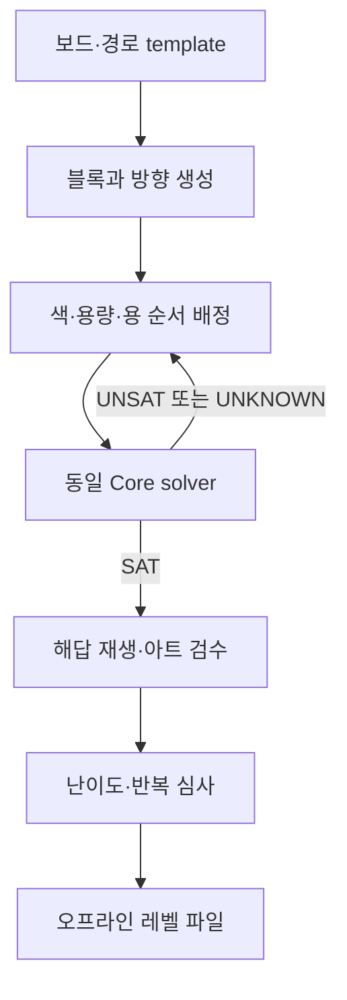

# 레벨 생성·solver·난이도

2026-09-08 / 우리 게임의 설계 결정. cozy-rescue-v1의 02 사양을 따른다. 원작 level data나 generator는 확보하지 않았다.

## 1. 기존 설계에서 바뀌는 것

template + procedural variation + solver validation은 유지한다. 그러나 생성 대상은 **하단 방향 블록 배치 + 용의 색/수용량 공급 + 시간/노출 + 경로**다. 3D 모델의 감긴 실을 제거하는 DAG가 아니다. 몸통의 시각 마디와 하단 선택 블록은 별도 데이터이며 색 자원 계약으로 연결된다.

| 방법 | 결정 |
|---|---|
| 완전 수작업 | 튜토리얼·첫 완성 레벨만 |
| 무검증 procedural | 사용하지 않음 |
| procedural + solver | 논리 인증에 필수 |
| template + variation | 보드·경로·시각 family를 고정하고 좋은 변형 생성 |

## 2. 제작 흐름

해답 순서를 먼저 제안하고, 그 순서로 실제 출발·감기·기다리기를 시뮬레이션하면서 공급을 배정한다. 위상 정렬 하나를 얻었다고 퍼즐이 풀리는 것은 아니다. 마지막에는 생성기의 witness와 독립적으로 동일 규칙 solver가 재검증한다. runtime 무한 생성보다 사전 인증된 파일 배포를 우선한다.

## 3. 데이터 계약

| Definition | 내용 |
|---|---|
| Level | id/revision, rulesetVersion, board, blocks, chains, exposure, rescue, defaults, seed |
| Block | id, colorId, capacity, 정수 footprint, escapeDirection |
| Board | 경계 polygon, 장애물, 허용 방향. 초기에는 4방향 정수 grid |
| Chain | id, 순서가 고정된 색 unit 목록, qStart, movementPeriod, pitch, capture bounds |
| Rescue | hp, 공격 위치, 후퇴, 무적, 시각 대상 ID |
| Model | bodyFamily, head, tail, material, pull anchors, LOD, unit visual mapping |
| Certificate | levelHash, rulesetHash, solverVersion, SAT witness, peakSlots, mode, 검증 시간 범위 |

seed만 저장하지 않고 완전한 배치를 저장한다. 모델·규칙·색·용량·시간 파라미터가 바뀌면 인증도 무효화한다.

정적 검증: ID 유일성, footprint 비겹침, 참조 존재, 용량 양수, 색별 총량 일치, 경로/노출 구간 유효성. 고정 보드의 제거 graph에 순환이 있으면 원인별로 거부한다. 미래 공급 장치를 넣으면 고정 DAG 검증만으로 충분하지 않다.

## 4. 방향 dependency

`A → B`는 A가 B의 탈출 swept 영역을 가로막아 A를 먼저 제거해야 한다는 뜻이다. renderer 가림과 무관하다. 방향이 다른 두 블록이 서로 막는 cycle은 실제 deadlock이 될 수 있다. 초기 생성기는 제거 가능한 순서를 보존하도록 역삽입한다.

8방향 확장에서는 중심 ray가 아니라 정수 polygon의 swept intersection을 사용한다. 같은 footprint와 direction은 Editor 미리보기·Core·solver가 함께 읽는다. Unity 물리와 별도 근사 규칙을 solver에 복제하지 않는다. 첫 4방향 단계에서 정밀도를 검증한 뒤 대각선으로 넓힌다.

## 5. solver 상태와 알고리즘

상태는 남은 블록 bitset, 자리에 배정된 block ID/잔여량, 예약 도착, 남은 yarn unit bitset/순서, 각 용 q·이동 누산, 수집 cooldown, 체력·무적을 포함한다. 색별 개수만 남기면 미래 노출과 순서를 잃으므로 금지한다. 슬롯 순서도 수집 우선순위에 영향을 주므로 함부로 정렬하지 않는다.

기본 탐색은 memoized DFS 또는 best-first. 공개 행동은 **합법 Launch(blockId)**와 **AdvanceToDecision(계속 감기)**다. 생각 모드의 Launch는 02처럼 12 tick을 진행한다. AdvanceToDecision은 최소 1 tick부터 StepTick을 반복해 다음 도착/수집/노출/피해 사건 또는 최대 20 tick에서 멈춘다. solver도 이 명령 경계에서만 다음 출발을 선택한다. 사용자 UI가 선택할 수 없는 중간 1 tick 시점의 출발을 해답에 넣지 않는다. 대기 분기는 실제로 있어야 하며 topo sort나 slot 정규화만으로 인증하지 않는다.

우선순위는 즉시 자리 회수 가능성, 노출 중인 색, 중요 통로 해제, 위험 여유다. 우선순위는 가지 순서만 바꾸며 불리해 보이는 합법 수를 제거하지 않는다. Advance 내부는 정확한 1 tick 반복으로 구현한다. 수학적 event jump 최적화는 사건 순서/노출 변화를 건너뛸 수 있으므로 처음에는 사용하지 않는다. 실시간 모드의 더 촘촘한 출발 시각을 탐색하려면 별도 정책으로 인증한다.

결과는 SAT/UNSAT/UNKNOWN으로 구분한다. 예산 초과는 UNKNOWN이다. 초기 해답은 존재해도 나쁜 선택으로 막힐 수 있다. 기본 4칸·booster 0의 SAT와 witness 재생을 정상 레벨 배포 조건으로 한다.

### 탐색 종료와 시간

움직이는 용은 유한한 체력과 유한한 수집 후퇴량을 갖는다. 총 unit 수와 공격 후퇴를 포함한 보수적인 최대 simulation tick을 계산할 수 있지만, 그 상한의 타당성을 먼저 검증한다. 단순히 60초 탐색했다고 UNSAT로 판정하지 않는다.

시간이 멈춘 테스트 fixture는 tick 절대값이 아닌 미래 동작에 필요한 잔여 timer/이동 누산을 key에 포함한다. 완전히 같은 미래 상태의 무한 Wait 반복을 제거한다. zero speed, 미래 이벤트 없음, slot full, 현재 수집 없음이면 정적 막힘을 증명할 수 있다. 상대 timer로 축약하기 전에는 작은 상태 전수 탐색과 비교한다.

### 인증과 사람 플레이

SAT이면 `(command, simulationTick)` 전체를 저장하고 새 초기 상태에서 정식 Core로 재생한다. 매 순간 출발 합법성·색 보존·최대 점유·체력·승리를 검사한다. 실제 사람이 수행할 최소 간격은 12 tick부터 검증한다. 흐름 모드의 무정지 완주까지 보장하려면 반응 여유 검사가 추가로 필요하다. 생각 모드 인증을 ‘모든 사람이 실시간으로 쉽게 클리어’라는 주장으로 바꾸지 않는다.

## 6. 완전하게 정의한 작은 수동 fixture

아래는 **원작 레벨 복제본이 아닌 독자 테스트 데이터**다. Board 범위 x,y=0..9, y 증가 방향=위. footprint는 아래 왼쪽 기준 (x,y,width,height). 사각형은 겹치지 않으며 밖으로 완전히 빠져나가면 제거한다.

| ID | 색 | 용량 | footprint | 방향 |
|---|---|---:|---|---|
| R4 | red | 4 | (0,8,1,1) | ↑ |
| B6 | blue | 6 | (0,5,1,2) | ↑ |
| R6 | red | 6 | (0,2,1,2) | ↑ |
| G10 | green | 10 | (3,0,1,3) | ↓ |
| B4 | blue | 4 | (5,0,1,1) | ↓ |
| G4 | green | 4 | (5,3,1,1) | ↓ |
| Y4a | yellow | 4 | (7,0,1,1) | ↓ |
| Y4b | yellow | 4 | (9,0,1,1) | ↓ |
| P4a | purple | 4 | (7,9,1,1) | ↑ |
| P4b | purple | 4 | (9,9,1,1) | ↑ |

공급 순서(머리→꼬리): G×4, R×4, B×6, R×6, B×4, G×10, Y×8, P×8. 총 **50 unit**. 블록 수용량도 G14+R10+B10+Y8+P8=50.

테스트 경로는 pitch16, q=112, capture 좌표 0..112를 포함하여 첫 8 unit이 보인다. 속도와 후퇴는 0, 수집 간격은 4 tick, 목표 체력은 감소하지 않는다. 소비 후 남은 순서를 압축하므로 뒤의 색이 앞으로 드러난다. 이 특수 설정은 수집·공간 규칙을 분리해서 시험하기 위한 것이며 정상 레벨은 동적 경로로 별도 인증한다.

확인할 dependency: R4→B6→R6, R4도 R6을 막음; B4→G4. G10과 나머지 네 대기 색 블록은 처음부터 탈출 가능하다.

**설계한 해답:** G10 → R4 → B6 → R6 → B4 → G4 → Y4a → Y4b → P4a → P4b. 각 출발 뒤 현재 가능한 수집이 더 없을 때까지 AdvanceToDecision을 반복한다. 이 순서는 최대 작업 자리 2개를 목표로 하는 수동 논증이며 아직 실행 코드로 검증한 결과가 아니다.

**명확한 실수 경로:** Y4a,Y4b,P4a,P4b를 먼저 올리면 네 자리가 모두 찬다. 처음 노출된 색은 G/R이라 수집이 없고, 속도 0이라 기다려도 바뀌지 않는다. 같은 초기 레벨에 좋은 순서와 deadlock이 공존한다. 광고가 아니라 undo로 복구한다.

## 7. 난이도와 콘텐츠

| 지표 | 의미 |
|---|---|
| 최소 필요 자리 Smin | 1..4 자리로 탐색. UNKNOWN을 정확한 최솟값으로 포장하지 않음 |
| 안전한 선택 비율 | 선택 뒤 SAT가 유지되는 비율. 샘플 값은 추정 |
| dependency 깊이/선택 폭 | 탈출 순서의 복잡도 |
| 잔여 용량 | 긴 실타래가 미완성으로 자리를 점유하는 양 |
| 노출 지연 | 필요한 색이 언제 capture 가능해지는가 |
| 위험 여유 | 해답에서 최소 남은 거리·체력·반응 시간 |
| 새로움 | 보드 topology, 방향, 용량, 색 구간, 경로, 마디 family |

우리 첫 24레벨 목표(원작 측정값 아님): 1–4는 4–8블록·3색·4방향, 5–12는 8–18블록·4–5색, 13–24는 16–32블록·5–8색과 선택적 대각선. 복수 용·공급 장치는 기본 24레벨이 재밌고 검증된 뒤 추가한다.

색만 바꾼 동일 보드는 새로운 구조로 세지 않는다. 최근 6레벨 안에 동일 보드 template 반복을 피하고, 긴 용·희귀 색·높은 용량·좁은 노출을 한꺼번에 올리지 않는다. 4칸을 한계까지 요구하는 레벨을 연속 배치하지 않는다. 24레벨로 무한 다양성을 약속하지 않는다.

## 8. 중요한 검증

막힌 방향, 긴 블록 모서리, 슬롯 예약 경합, slot full 후 자동 수집, 같은 색 실타래 2개, 마지막 수집/피해 동시 발생, 강화 없는 동적 노출, 앱 정지/복귀, 진행 중 undo, 색 보존, 시간 초과 UNKNOWN, 인증 해시 불일치를 검증한다. 시각 데모 단계에서는 이 시스템 전체를 만들지 않는다.
