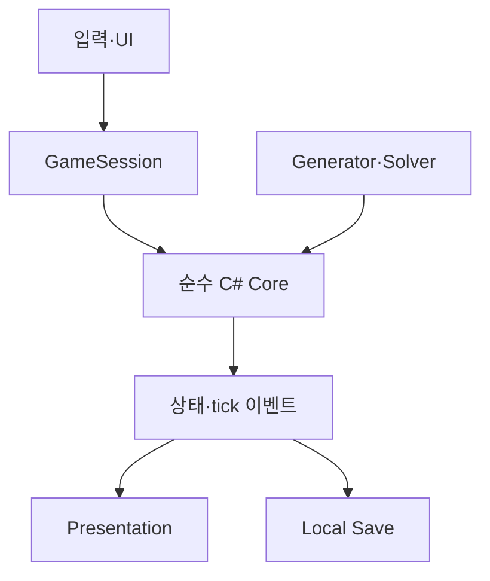

# 엔진·아키텍처·Android 결정

2026-09-08. 기존 엔진/도구 판단은 계승하고 도메인 구조를 Wool Crush에 맞게 교정한다. 이하 우리 설계다.

## 1. 엔진

**Unity 6.3 LTS / Editor 6000.3.23f1 / C# / URP Forward**를 기준으로 한다. 해당 패치는 공식 릴리스 2026-08-26을 확인했다. ‘가장 최신’이라는 주장이 아닌 재현 가능한 고정점이다. 설치 시 알려진 문제와 Android 컴파일을 확인한 뒤 lock한다. [T1]

| 요구 | Unity | Godot | 결정 |
|---|---|---|---|
| 3D·모바일 셰이더 | URP/Lit/Shader Graph·Profiler | Mobile renderer·spatial shader 가능 | 둘 다 가능, Unity 도구 체계 선택 |
| 긴 생물 경로·실 | 공식 Splines·Mesh API | Curve3D·custom mesh | Unity |
| Codex 수정 | 순수 C# core·Editor 자동 생성·batchmode | GDScript·텍스트 scene 편리 | 복잡한 기술 아트와 C# solver 통일 |
| Android | Hub 모듈·IL2CPP | export 가능, C# 경로는 별도 지원 상태 확인 필요 | Unity 주 경로 |
| 비용/의존성 | Personal 조건 확인 필요 | 오픈소스 | 유료 플러그인 없이 시작 |

원작 엔진을 알아냈다는 주장이 아니다. Godot에서도 같은 미감이 가능하지만 이번 프로젝트는 Blender→Unity import, shader 튜닝, 기기 profiler를 묶어 제작 위험을 낮춘다.

## 2. 패키지와 도구

| 항목 | 기준 | 이유 |
|---|---|---|
| Editor | 6000.3.23f1 | 재현 기준 |
| URP | 해당 Editor core package | opaque knit material·mobile soft shadow |
| Splines | com.unity.splines 2.9.0 | 길/용/연결 실 authoring [T2] |
| Input System | com.unity.inputsystem 1.20.0 | touch·mouse·UI 입력 [T3] |
| uGUI/TMP | 해당 Editor 대응 core | 작업대·수용량·한국어 UI |
| Test Framework | 해당 Editor 대응 core | Core/solver/save 경계 |
| Blender | 4.5 LTS 계열 | Python·GN 제작. 사용한 patch 기록 |

URP/uGUI/Test Framework의 미검증 patch 번호를 임의로 적지 않는다. 실제 해석된 manifest·packages-lock·ProjectVersion을 고정한다. Splines는 authoring에 쓰고 runtime 경로는 bake된 배열부터 사용한다.

처음에는 DOTween·Cinemachine·Addressables·ECS·VFX Graph·유료 fur·광고/IAP/Analytics/Services를 추가하지 않는다. 작은 자체 tween, Unity Animator, 로컬 catalog면 충분하다. Jobs/Burst는 실제 병목이 측정된 후 도입한다.

## 3. 소유권

Core는 Transform/Physics/Material/렌더 시간에 접근하지 않는다. 정수 경로 좌표·footprint·색 ID·tick을 소유한다. 실시간 모드는 wall-clock을 Core tick으로 바꾸는 Session 정책이다. 앱 정지에서 누락된 시간을 나중에 따라잡지 않는다.

| 계층 | 책임 |
|---|---|
| Core.State | BlockState, WorkSlot, YarnUnit, ChainState, RescueState, timers |
| Core.Rules | EscapeValidator, SlotReservation, StepTick, CapturePolicy, ExposurePolicy, Outcome |
| Core.Search | exact state key, solver budget, witness replay, SAT/UNSAT/UNKNOWN |
| Application | 명령·모드·undo·revision·hint·진행 |
| Presentation | BlockView, SpoolView, ChainRenderer, UnravelAnimator, RescueActor, FixedCamera |
| Content | Level/Board/Chain/Model/Theme/Palette definitions |
| Infrastructure | 로컬 저장·schema migration·Android adapter |
| Editor | generator, board/path authoring, solver/quality validation |

## 4. 디렉터리

| 예정 경로 | 책임 |
|---|---|
| Assets/CozyRescue/Core/State | 값 타입과 snapshot |
| Assets/CozyRescue/Core/Rules | 방향·예약·tick·노출·수집·승패 |
| Assets/CozyRescue/Core/Search | solver·witness |
| Assets/CozyRescue/Application | Session·모드·undo·hint |
| Assets/CozyRescue/Presentation/Board | 입력 표현·탈출 애니메이션 |
| Assets/CozyRescue/Presentation/Yarn | 마디·연결 실·감김 |
| Assets/CozyRescue/Presentation/Actors | 머리·구조 동물·성공 반응 |
| Assets/CozyRescue/Presentation/UI | 작업대·숫자·도구·설정 |
| Assets/CozyRescue/Content | 로컬 definition·catalog |
| Assets/CozyRescue/Infrastructure | save·serializer·플랫폼 |
| Assets/CozyRescue/Shaders | KnitLit·consumption mask |
| Assets/CozyRescue/Editor | scene 생성·art importer·generator·validation·build |
| Assets/CozyRescue/Tests | EditMode Core, 필요한 PlayMode 경계 |
| Assets/CozyRescue/Scenes | WoolLab, GameplayLab, Game, Gallery |
| ArtSource/Blender | 직접 만든 base·stitch tile·Python/GN |
| ArtSource/Recipes | 마디/머리/경로 recipe |
| ArtSource/Exports | mesh·texture·binding manifest |
| Docs | 사양·증거·결정 로그·실측 |

계층별 asmdef. Core는 noEngineReferences. Python은 asset 제작만 담당하고 게임/solver 규칙을 중복 구현하지 않는다. 큰 Unity YAML을 추측해서 수정하는 대신 idempotent Editor 생성기와 실제 import로 작업한다.

## 5. 이벤트·저장 계약

이벤트: BlockReserved, BlockDeparted, SpoolArrived, YarnCaptured, SpoolCompleted, ExposureChanged, TargetHit, LevelWon. 각각 tick/revision/stable ID 포함. presentation이 취소/재구축되어도 Core 결과는 같다.

Undo는 한 명령 전 snapshot 복원. revision이 바뀌면 과거 coroutine·tween의 콜백을 무시한다. 저장에는 진행 중 도착 예약과 남은 cooldown도 포함한다. 복구 시 시각은 현재 snapshot에서 재생성할 수 있어야 한다.

## 6. Android

ARM64·IL2CPP·Portrait·safe area, 개인 설치용 서명 APK. 최소 Android API26, target/compile API36을 첫 프로젝트 목표로 한다. 스토어 출시 요구를 주장하는 것이 아니다. Hub의 해당 Editor용 Android Build Support·SDK/NDK·OpenJDK를 사용하고 실제 버전을 빌드 기록에 남긴다. 기존 조사 기준 NDK r27c/OpenJDK17은 설치 환경에서 재확인한다. [T4]

OpenGLES3부터 검증하고 Vulkan은 동일 씬에서 측정 후 결정한다. Linear·HDR off·MSAA2×. release merged manifest에서 불필요한 INTERNET·광고 식별자·analytics 항목을 확인한다. development profiler 연결과 release 동작을 구별한다.

중급 Android 6GB RAM·Adreno619/Mali-G68급을 60fps 목표군으로, 낮은 사양은 30fps 지원군으로 잡는다. 이는 성능 측정 결과가 아니다. 15분 열 안정성·메모리·프레임 시간을 실제 기기에서 확인한다. 아내의 정확한 기기 정보를 아직 요구하지 않고, 최종 수용 시 해당 기기에서 확인한다.

## 공식 근거

- T1 https://unity.com/releases/editor/whats-new/6000.3.23f1
- T2 https://docs.unity3d.com/6000.3/Documentation/Manual/com.unity.splines.html
- T3 https://docs.unity3d.com/6000.3/Documentation/Manual/com.unity.inputsystem.html
- T4 https://docs.unity3d.com/6000.3/Documentation/Manual/android-supported-dependency-versions.html
- Unity Personal 조건: https://unity.com/products/unity-personal
- Godot 대안: https://docs.godotengine.org/en/stable/tutorials/export/exporting_for_android.html
