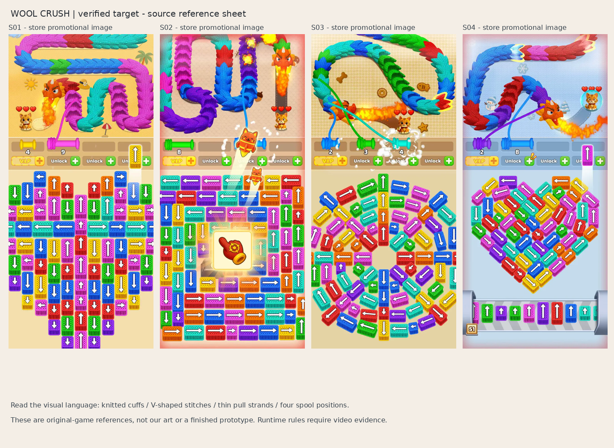
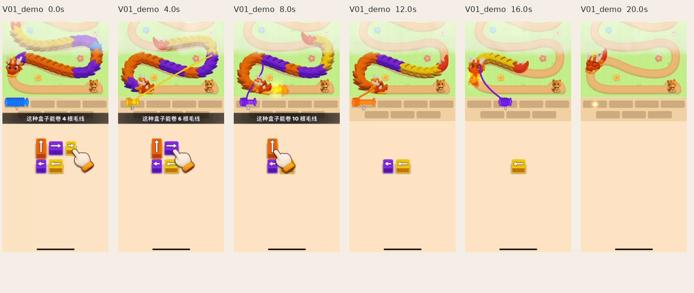
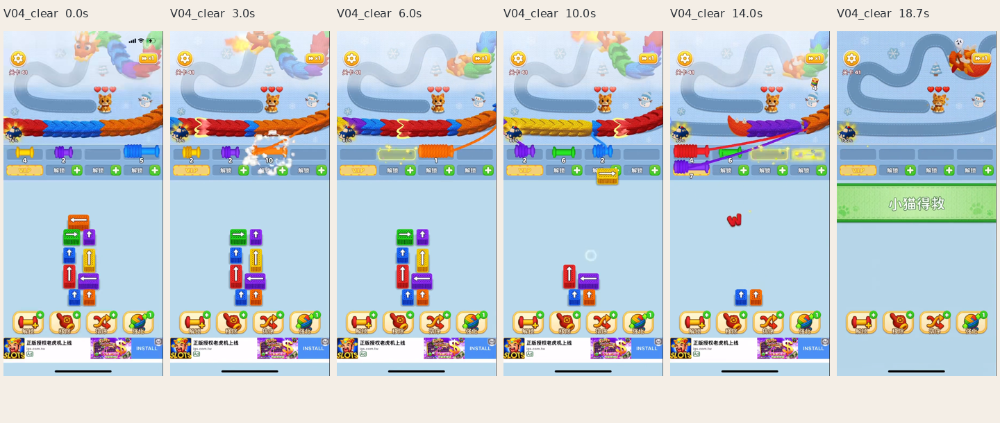
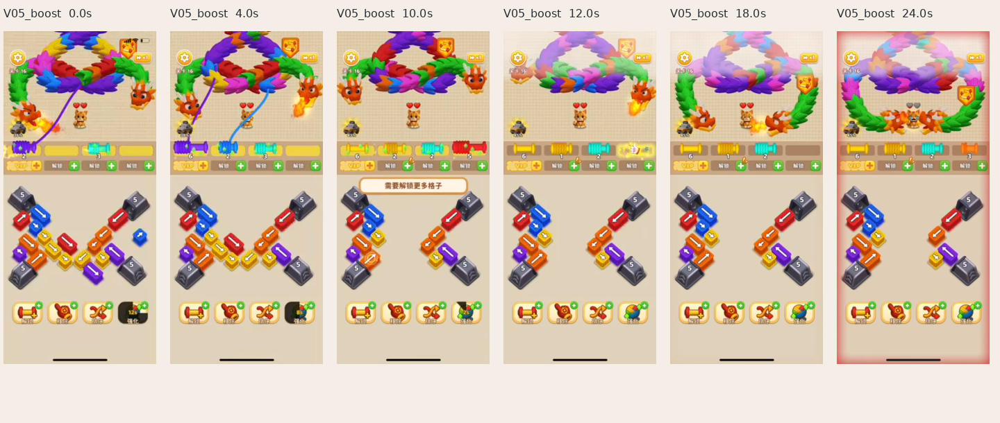
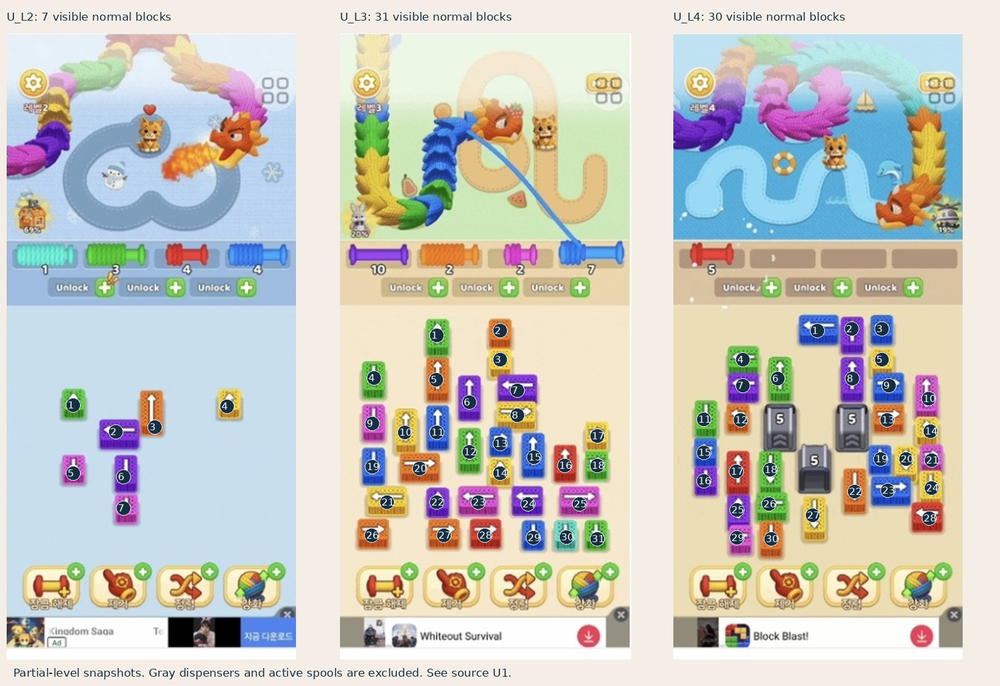

# Visual Reference Index — 털실 마스터

2026-09-08. 아래 이미지는 **원작 비교 자료**다. 우리 게임의 완성 화면이나 생성한 자산이 아니다. 편집은 원본 픽셀의 crop·축소·배치·번호 표시에 한정했고 AI 보정으로 조직을 만들어 넣지 않았다. 원작 그림을 texture/model/UI 자산으로 import하지 않는다.

## 먼저 볼 자료

- [사용자가 게임을 확정한 6패널 이미지](crush_references/U01_confirmed_game.jpg): 실제 한국어 UI, L2/3/4/12.
- [원작 확대 참조](crush_references/MATERIAL_CLOSEUPS.png): 미세 뜨개 조직과 큰 마디 실루엣의 분리.
- [L41 진행·성공 프레임](crush_references/V04_clear_EVIDENCE.png): 이동→수집→자리 회수→구조 성공.
- [직접 센 하단 보드](crush_references/COUNTED_BOARDS.png): 보이는 잔여 블록 수. 초기 전체 레벨 수 아님.

S01–04는 스토어 홍보 이미지다. 효과·UI 확대·보드 밀도가 실제 실행 화면보다 과장될 수 있으므로 기능 확인은 U1/V1/V4/V5를 우선한다.

## Yarn / knit close-up

crop 좌표는 각 S 원본 643×1394의 `(left, top, right, bottom)`이며 오른쪽/아래 경계는 제외한다. 확대가 원본보다 새로운 정보를 제공하지는 않는다.

| Ref | 원본·영역 | 관찰 | 구현에 연결할 항목 |
|---|---|---|---|
| A | S01 (260,85,500,190) | 파랑 마디에 작은 V/고리가 반복. 위쪽 ridge와 아래 접촉부 명암 | 공용 knit normal/AO, 방향성 UV, 큰 둥글림은 mesh |
| B | S03 (370,60,635,300) | 청록/초록 마디가 굽은 경로에서 겹침. 끝이 둥글고 두께가 있음 | 반복 cuff mesh, arc-length 배치, 끝부분 두께·겹침 |
| C | S04 (277,267,419,430) | 머리도 조직이 있으나 눈·뿔과 반응이 다름 | 부위별 재질 분리. 원작 얼굴 디자인 자체는 복제 금지 |
| D | S01 (108,600,285,830) | 블록의 전면/측면 편물 방향, 흰 화살표의 높은 대비 | 얕은 3D 블록+별도 읽기 쉬운 화살표 |
| E | S03 (23,456,440,543) | 실타래 축은 매끈, 감긴 부분은 두꺼운 코일, 연결 선은 가늘고 선명 | 축/실 재질 대비, 감김 mesh, 연결 tube |
| F | S03 (368,348,461,448) | 큰 머리·눈, 짧은 몸·발, 둥근 볼 | 독자 고양이 비율 출발점. 무늬·얼굴 세부는 새로 제작 |

**관찰:** 마디 표면은 단순 매끈한 tube보다 편물 조직에 가깝다. **가설:** 실제 원작은 geometry+texture/normal을 혼합했을 수 있다. twisted strand의 ply 개수, normal 해상도, shell fur, polygon 수는 확정하지 못했다.

**우리 구현:** B=마디 폭 기준, 마디 400–900 triangles와 12–20 stitch 열/B에서 시작한다. 연결 실만 지름 .035–.060B, 단면 8분할 tube로 만든다. 전신을 같은 tube로 감지 않는다. 상세값은 04·13.

## Model proportions / shape language

| 대표 자료 | 비교할 부분 | 판단 기준 |
|---|---|---|
| S01, S04 | 용 머리와 인접 몸통 | 머리 폭이 대략 몸통 폭 .9–1.4배. 광각으로 얼굴만 크게 만든 구도가 아님 |
| S03/F, U1 하단 | 고양이 | 큰 볼·눈, 짧은 팔다리. 귀 포함 여부를 고정하고 비율 측정 |
| S01/A, S03/B | 마디 | 겹친 잎/편물 주머니 모양, 폭이 넓고 끝이 통통함 |
| U1 vs S02 | 과장 정도 | 실제 작은 UI에서도 캐릭터가 읽히는지 우선. 장갑 광고 크기 그대로 구현하지 않음 |

원작의 다양한 음식/집/동물 모델을 관찰한 자료는 없다. 여기서는 용·고양이·블록의 공통 언어를 추출한다. 독자 솜구름 용은 얼굴, 귀, 마디 끝 구조, 꼬리를 새로 만든다.

## Color

S01 황색·S02 분홍·S03 크림·S04 푸른 배경과 선명한 활성 색을 비교한다. 원작은 저채도 배경과 고채도 실의 대비가 크다. ‘전부 파스텔’로 만들면 원작의 가독성을 잃는다.

관찰 체크: 같은 파랑이 몸통·블록·실타래에서 같은 범주로 읽히는가; 어두운 AO가 보라/파랑을 혼동시키는가; 흰 화살표가 조직에 묻히는가. 03의 hex palette는 독자 시작값이며 원본에서 추출한 정확한 색은 아니다.

## Lighting

S01/A의 마디 아래, S03/B의 겹침, D의 블록 접촉부를 본다. 밝은 면은 넓고 골은 부드럽게 어두워져 촉감이 난다. 얇은 강한 하이라이트보다 diffuse와 AO가 중요해 보인다. 조명 방향/개수·HDRI·SSS 사용은 확정할 수 없다.

우리 데모는 주광 하나+밝은 ambient+짧은 soft shadow로 비교한다. knit normal off/on, AO off/on, fuzz off/on을 같은 캡처에서 대조하여 각각 실루엣·조직·잔털에 기여하는지 확인한다. 전체 화면 bloom으로 재질 부족을 가리지 않는다.

## Camera / composition / UI

U1, V4를 S01–04와 같은 세로 비율로 놓고 비교한다. 원작의 주 생물은 화면 상단 약 1/3, 작업대 약 1/10, 아래는 큰 선택 보드다. 실제 화면에는 하단 도구와 광고가 있다. 03에 픽셀 경계를 기록했다.

- 높은 elevation의 약한 원근. 정확한 orthographic/FOV/camera distance는 Unknown.
- 플레이 구도는 고정되어 있고 생물이 길을 따라 움직인다. 3D 오브젝트를 돌려 뒷면을 찾는 게임이 아니다.
- 원작의 작업대는 네 자리와 남은 용량 숫자로 읽힌다. 자물쇠·VIP·광고는 우리 UI에 넣지 않는다.
- S04의 conveyor/51 표기는 홍보 화면에서만 확인했으므로 첫 gameplay 사양에서 제외한다.

우리 화면에서는 광고 공간을 터치 여유와 보드에 돌려준다. 35/10/44/11 비율은 안전 영역 기준의 설계값이며 원작 정확한 수치가 아니다.

## Animation reference

V1: 노랑 블록/실타래 → 보라 → 긴 주황. 00:06의 6 용량 자막은 [개별 프레임](crush_references/V01_demo_006.0s.png)에서 확인한다. 튜토리얼의 안내 손은 우리 UI로 복제하지 않는다.

| 구간 | 봐야 하는 것 | 구현 선택 |
|---|---|---|
| V4 00:02–00:04 | 주황 블록의 탈출과 작업대 도착 | 초기 직선 탈출 tween 후 곡선 이동 |
| V4 00:03–00:06 | 주황 구간의 실과 감기는 코일 | source 변형+동적 spline+destination 감김 동기화 |
| V4 00:08–00:14 | 여러 실타래가 함께 감김 | 4 연결선까지 가독성, 같은 unit 중복 소비 방지 |
| V4 00:14–00:18.7 | 몸통/보드 정리, 100%, 구조 성공 | 마디 간격 회복과 별도 성공 반응 |

V5 00:10은 자리 부족 경고, 00:12–00:14는 강화 종료 후 안개. 00:18–00:24는 접근/위험이 계속된다. 이 영상은 최종 실패 전까지이고 revive나 undo를 증명하지 않는다.

원작 애니메이션의 정확한 easing·duration·mesh deformation은 Unknown이다. 04·13의 100–350ms 범위는 보이는 촉감을 구현하기 위한 우리 시작값이며 영상에서 정밀 추출한 값이 아니다.

## 레벨 비교용 번호 부착 이미지

U1 하단 L2=7개/5색, L3=31개/8색, L4=30개/7색. L4의 회색 공급 장치 3개는 일반 블록 수에서 제외했다. 관찰 시점은 각각 진행률 69/20/19%여서 난이도가 레벨 번호와 블록 잔여 수만으로 증가한다고 해석하면 안 된다. 전체 yarn 단위 수·숨은 큐는 Unknown이다.

## 소스 URL

- U1: 사용자 제공 이미지와 https://m.blog.naver.com/gg_bites/224030807532 . 블로그 본문은 미열람.
- 스토어 이미지 목록: https://appshunter.io/ios/app/6743385713
- S01: https://is1-ssl.mzstatic.com/image/thumb/PurpleSource211/v4/39/7d/17/397d1747-90f6-c199-c773-a44c7b3fd1a2/6.9-1.jpg/643x0w.webp
- S02: https://is1-ssl.mzstatic.com/image/thumb/PurpleSource211/v4/92/b2/90/92b2904d-cfad-4891-9fd9-539b5c665f61/6.9-2.jpg/643x0w.webp
- S03: https://is1-ssl.mzstatic.com/image/thumb/PurpleSource211/v4/0d/c6/c1/0dc6c1b3-3b00-695f-1657-0310f06b0055/6.9-3.jpg/643x0w.webp
- S04: https://is1-ssl.mzstatic.com/image/thumb/PurpleSource221/v4/7f/26/fa/7f26fa60-87a3-1f3d-a3e0-58d968f49bde/6.9-4.jpg/643x0w.webp
- V1/V4/V5의 기사·직접 MP4·게시일·hash: [11_EVIDENCE_MATRIX.md](11_EVIDENCE_MATRIX.md#영상-출처중복-검증).

파일명 `V04_clear_018.7s.png`는 V4의 지정 시각 디코드 프레임이다. 여러 프레임 모음은 `_EVIDENCE.png`. 원본 해상도를 넘어선 조직 세부를 새로 관찰했다고 주장하지 않는다. 자료 확보는 2026-09-08이며 스토어 이미지의 최초 게시일/정확한 앱 버전은 Unknown이다.
