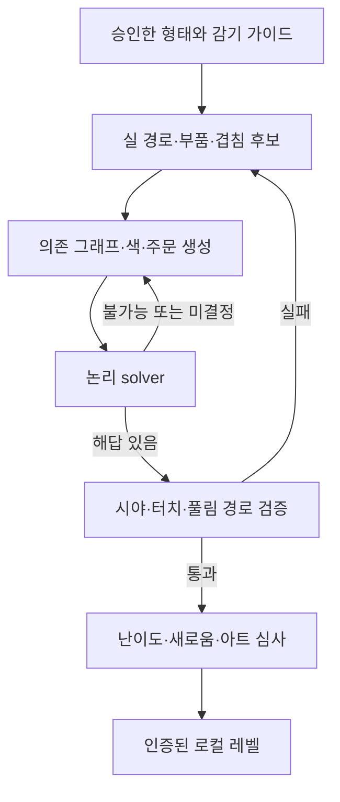

# 레벨 제작·검증·난이도 시스템

설계 기준: `cozy-orders-v1` / 02의 후보 규칙을 사용하는 우리 게임. 아래 레벨 수량은 원작 측정값이 아니다.

## 1. 결정

**D. 형태 템플릿 + 절차적 변형에 C. solver validation을 결합한다.** 사람은 실루엣·부품 분할·감기 방향·기본 겹침을 승인하고, 도구가 색·주문·일부 의존관계·난이도를 변형한다. 완성된 레벨은 오프라인 파일로 배포한다. MVP에서 휴대폰이 새 레벨을 무제한 생성하지 않는다.

| 방법 | 장점 | 이 프로젝트의 문제 | 채택 |
|---|---|---|---|
| A 완전 수작업 | 조형과 퍼즐을 정교하게 연출 | 수백 레벨 제작·해답 회귀 검증 부담 | 튜토리얼·대표작만 |
| B 순수 procedural | 많은 후보를 빠르게 생성 | 못생긴 겹침, 불공정 가림, 풀리지 않는 주문 | 단독 사용 금지 |
| C procedural + solver | 논리적 해답 보장 가능 | solver는 귀여움·시야·실 충돌을 판단하지 못함 | 논리 검증 필수 계층 |
| D template + variation | 조형 품질과 생산성 균형 | 단순 재색칠 반복 위험 | 주 제작 방식, C와 결합 |

원작 후반 반복 불만은 01의 R05·R07·R28~R30 등에서 확인한 사용자 보고다. 이것만으로 원작 generator의 존재를 추론하지 않는다. 우리는 처음부터 모델 수와 레벨 수를 따로 관리한다.

## 2. 제작 흐름



입력 모델을 먼저 완성한 뒤 무작위 색만 넣는 방식으로는 부족하다. 감기 경로의 부품 경계가 논리 조각과 대응해야 한다. geometry와 graph를 함께 수정하되 Core는 geometry를 읽지 않는다. 둘을 연결하는 안정적인 `pieceId`가 계약이다.

## 3. 데이터 계약

| 데이터 | 필수 필드 | 소유 책임 |
|---|---|---|
| ModelDefinition | modelId, revision, bounds, partIds, piece visual bindings, wrap recipe, LOD, approved views | 형태·경로·충돌 proxy |
| LevelDefinition | levelId, revision, rulesetVersion, modelId/revision, pieces, orderQueue, seed, difficulty tag | 확정된 퍼즐 |
| PieceDefinition | id, colorId, blockerIds, supportGroupId, visualBindingId | 논리 1단위와 표현 연결 |
| OrderDefinition | id, colorId, capacity=3, artworkRegionId | 최초 활성 주문을 포함한 전체 유한 순서 |
| Palette | paletteId, ColorId→색·심벌·소리 대응 | RGB가 아닌 ColorId로 매치 |
| ValidationCertificate | levelHash, rulesetHash, solverVersion, result, witness, peakBuffer, cameraWitnesses | 검증 근거 |
| DifficultyReport | 지표, 측정 방식, 탐색 한도, 사람 플레이 기록 | 추정과 증명 구분 |

아래는 구조 설명용 일부 데이터이며 실행 파일이 아니다.

```json
{
  "schemaVersion": 1,
  "levelId": "garden_014",
  "rulesetVersion": "cozy-orders-v1",
  "modelId": "puff_seed_cup",
  "modelRevision": 2,
  "seed": 48127,
  "activeOrderCount": 2,
  "bufferCapacity": 5,
  "pieces": [
    {"id": "p01", "colorId": "mint", "blockerIds": [], "visualBindingId": "stem_a"},
    {"id": "p02", "colorId": "coral", "blockerIds": ["p01"], "visualBindingId": "cup_b"}
  ],
  "orderQueue": [
    {"id": "o01", "colorId": "coral", "capacity": 3},
    {"id": "o02", "colorId": "sky", "capacity": 3}
  ]
}
```

완전한 파일에는 생략 없는 모든 조각·주문이 들어가야 한다. seed만 저장하지 않는다. PRNG 구현과 generator 버전도 기록하고, 배포 데이터는 완전히 구체화한다. 엔진 업데이트 때문에 같은 레벨이 달라져서는 안 된다.

### 정적 무결성 검사

- pieceId·orderId·visualBindingId가 유일하고 참조가 존재한다.
- 자기 blocker·순환 의존이 없다. 모든 piece가 정확히 한 visual binding을 갖는다.
- 색별 조각 수가 3의 배수이고, 해당 색 주문 수 × 3과 정확히 같다.
- 전체 주문이 전체 조각을 남김없이 수용한다. 큐 소진 후 만들어지는 임의 주문은 없다.
- 시각 조각의 layer 수가 논리 blocker 수를 대신하지 않는다.
- 레벨 해시는 규칙·그래프·색·주문·기본 용량·모델 revision을 포함한다.

DAG는 필요조건이지 충분조건이 아니다. 순환이 없어도 필요한 색이 너무 늦게 열리면 보관칸 부족으로 풀리지 않는다.

## 4. 해답을 포함하는 후보 생성

우선 안전한 제거 순서 `witness`를 만든다. 기하학적 제약을 만족하는 위상 순서를 뽑고, 주문 수집을 시뮬레이션하면서 색을 3개 단위로 배치한다. 활성 주문으로 직접 갈 조각과 잠시 보관할 조각의 비율을 목표 난이도에 맞춘다. 큐의 다음 색도 이 시뮬레이션의 제약을 만족하도록 정한다.

이것은 ‘위상 순서에 무작위 색을 칠하면 풀린다’는 보장이 아니다. 매 단계 02의 실제 `ApplyMove + Normalize`를 호출하고, 기본 용량 5를 넘기지 않는지 확인한다. 실패하면 색·큐 선택을 backtrack한다. 최종 출력은 별도의 solver가 다시 풀어 생성기의 실수를 잡는다.

권장 순서:

1. 아트 승인 템플릿에서 조각 수·부품 크기·허용 blocker 후보를 선택한다.
2. 실 경로와 겹침을 생성하고, template recipe가 허용한 제거 선후관계만 추가한다.
3. 위상 순서를 제안한다. 병렬로 열리는 선택지를 남기며 깊이 상한을 둔다.
4. 색·주문을 배정하면서 witness를 실제 규칙으로 시뮬레이션한다.
5. 전체 solver로 SAT와 해답 재생을 검증한다.
6. geometry·카메라 검증과 품질 지표를 계산한다.
7. 최근 콘텐츠와 너무 비슷하면 버린다. 통과한 것만 사람이 썸네일·플레이로 승인한다.

무작위 후보를 모두 저장하지 않는다. 실패 이유를 `cycle / slot_unsat / unknown / invisible / collision / duplicate / art_reject`로 나눠 제작 도구에만 기록한다. 플레이어 행동 수집은 없다.

## 5. solver 설계

### 탐색 상태

`removedBitset`, 인덱스별 활성 주문 ID·수집량, 다음 큐 인덱스, 보관 조각과 진입 순서를 상태로 둔다. 이미 Board를 떠난 조각은 blocker를 해제한 상태다. 모든 move 후 자동 이동을 끝까지 정규화하므로 안정 상태만 탐색한다.

검색 전용 key는 제거 비트셋·활성 주문 상태·큐 위치·보관 색 수로 축약할 수 있다. **단, 이 규칙에서 동일색 piece의 정체성과 보관 순서가 미래의 승패에 영향을 주지 않는다는 동치성 검증을 통과한 경우에만** 사용한다. 초기 구현은 정확한 상태 key로 시작한다. 활성 슬롯을 함부로 정렬하지 않는다. 낮은 슬롯을 먼저 채우는 큐 규칙 때문에 두 상태가 다를 수 있다.

### 알고리즘

Memoized DFS를 기본으로 한다. 유효 move 하나는 Board 조각을 정확히 하나 줄이므로 undo를 제외한 상태공간에는 이전 Board 상태로 돌아가는 순환이 없다. 최대 탐색 깊이는 조각 수 N이다. 우선순위는 주문 즉시 완료, 보관 감소 예상, blocker 해제 수, stable pieceId로 정하되 나머지 합법 수를 버리지는 않는다.

```text
Solve(state):
    state = Normalize(state)
    if IsWon(state): return SAT(empty witness)
    if exactKey(state) in provenUnsat: return UNSAT
    if budget exhausted: return UNKNOWN
    moves = EnumerateLegalTransfers(state)
    for move in ordered(moves):
        result = Solve(ApplyMove(state, move))
        if result is SAT: return SAT(move + result.witness)
        record whether result is UNKNOWN
    if any branch UNKNOWN: return UNKNOWN
    memoize state as proven UNSAT
    return UNSAT
```

`UNKNOWN`은 해답 없음이 아니다. 제작 중 시간·메모리 제한에 걸린 후보는 보류하거나 재생성한다. 플레이 중에는 ‘이 상태는 풀 수 없어요’라고 표시하지 않는다. 독립 조각 교환 가지치기나 대칭 축약은 기본 solver가 정확해진 후, 동치성 증거와 작은 레벨 전수 비교를 갖추고 추가한다.

모든 완주 경로가 N번의 정상 탭을 쓰므로 최단 탭 수를 찾는 일반 A*는 난이도 평가에 별 도움이 없다. 목적은 도달 가능성, 필요한 최소 보관 용량, 유효 선택의 폭이다. 가장 짧은 해답이 아니라 **가장 적은 최대 보관량을 쓰는 해답**을 찾아야 한다.

### 결과 인증

SAT이면 원래 ID로 된 전체 move sequence를 저장한다. 정식 Core로 새 초기 상태에서 다시 재생해 승리, 보관 최대치, 각 단계 선택 가능성을 검사한다. 인증서와 데이터 해시가 다르면 배포 검사에서 실패한다. solver 자체의 ‘성공’ 문자열만으로 통과시키지 않는다.

편안하게 모드도 초기 상태를 따로 검증한다. 용량이 늘면 항상 같은 해답 순서가 통할 것이라고 가정하지 않는다. 활성 주문 수가 달라지면 큐 교체 시점과 자동 이동이 달라지므로 실제 규칙으로 재생한다. 표준 인증을 편안하게 인증으로 대체할 수는 없다.

`Bmin`은 활성 주문 2개를 고정하고 B=0부터 5까지 순차 검사해 구한다. 작은 용량의 UNSAT가 완전 탐색으로 증명되지 않으면 ‘정확한 Bmin’ 대신 `증명된 하한 / 발견한 해답 상한`을 보고한다.

## 6. 실수와 불공정 설계의 구분

초기 SAT는 모든 선택이 안전하다는 뜻이 아니다. 02의 9조각 fixture에 독립적인 노랑 y1~y3를 추가하고, 초기 R/B 이후 주문을 G/Y로 하면 12조각이 된다. 빨강 r1/r2/r3는 각각 g1/g2/g3에 막혀 있고, b2는 r2, b3는 r3에 막혀 있다.

좋은 순서는 초록을 먼저 보관하며 빨강을 완성하는 것이다. 빨강 완료 후 G가 열리고 보관 초록이 빠진다. 이후 파랑·노랑도 마칠 수 있다. 반면 y1,y2,y3,g1,g2를 먼저 보관하면 5칸이 찬다. r1,r2,b1,b2는 처리할 수 있지만, g3를 넣지 못해 r3와 b3를 열 수 없다. 완전히 같은 고정 레벨에서 **초기 해답은 있지만 나쁜 선택은 막힘**을 만든다.

이런 실수 가능성은 퍼즐의 일부다. 광고·구매 대신 undo를 제공한다. 생성기는 정답이 존재한다는 최소 기준에 더해, 평범한 선택이 너무 자주 강제 복구로 이어지는 후보를 난이도 측정과 사람 테스트에서 제외한다. 완화 모드는 최후 수단이 아니라 사용자가 자유롭게 고르는 놀이 방식이다.

## 7. 기하학적으로도 플레이 가능한가

논리 해답만으로는 부족하다. 모든 해답 조각이 화면 안에서 실제로 보이고 눌리는지 검사한다.

| 검사 | 방법 | 보장 범위 |
|---|---|---|
| witness 접근성 | 각 해답 상태에서 허용 카메라 후보들을 렌더/ID pick 검사 | 적어도 한 해답 경로가 시각적으로 실행 가능 |
| 터치 면적 | 화면 기준 노출 영역과 최소 선택 영역 검사 | 한 픽셀만 보이는 가짜 selectable 배제 |
| UI 충돌 | safe area·상단 그림·도구 영역을 제외한 hit 검사 | UI 뒤를 눌러야 하는 해답 배제 |
| 논리 겹침 설명 | blocker가 잠금 방향·감기 순서와 시각적으로 대응하는지 확인 | 보이는데 이유 없이 잠긴 조각 감소 |
| 풀림 경로 | expanded tube/capsule proxy와 transfer 경로 충돌 검사 | 벽을 뚫는 대표적인 실 이동 배제 |
| 다른 분기 | 작은 레벨 전수 상태, 큰 레벨 다양한 합법 플레이 샘플 | witness 외 경로의 문제 탐색; 대형 전수 보장 아님 |

인접한 표면을 화면 공간에서 투영해 겹쳤다고 자동 blocker로 지정하지 않는다. 카메라를 돌리면 바뀌는 겹침이다. template의 실제 감기·지지 관계로 그래프를 만들고, 시야 검사는 별도로 한다. 모든 합법 조각을 반드시 한 시점에 보여 줄 필요는 없지만, 허용 회전·확대로 각각 접근할 수 있어야 한다.

초기 도구는 24~48개의 일정한 카메라 방향으로 후보를 찾고, 실패한 조각만 더 촘촘하게 검사한다. 이 수치는 구현 시작값이다. 샘플 실패를 수학적 비가시성 증명이라고 부르지 않는다. 승인한 좋은 시점은 힌트 카메라에 재사용한다.

## 8. 난이도와 진행

| 지표 | 의미 / 한계 |
|---|---|
| Bmin 또는 범위 | 공간 압박의 핵심. 탐색 제한을 표시 |
| dependency 최장 경로 | 몇 번 제거해야 깊은 조각이 열리는가 |
| 초기·중간 선택 폭 | 같은 순간의 합법 선택 수; 많아도 모두 함정이면 쉽지 않음 |
| 안전한 선택 비율 | 가능한 선택 후 SAT가 유지되는 비율. 샘플링 값은 추정치 |
| lookahead | 잘못된 선택을 알아차리기까지 필요한 단계 추정 |
| 시각 밀도 | 작은 조각·가림·색 경계의 복잡도 |
| 회전 필요량 | 해답 카메라 방향 전환·각도 변화 추정 |
| 반복 피로 | 형태·그래프·주문 리듬이 최근 것과 겹치는가 |

조각 수 하나로 난이도를 정하지 않는다. 구조가 단순한 60조각은 복잡한 24조각보다 쉬울 수 있다. 처음에는 단일 종합 점수보다 지표 벡터와 사람 평가를 나란히 둔다.

아래는 우리 버전의 **콘텐츠 목표**, 원작 초·중·후반 수치가 아니다.

| 구간 | 조각 수 | 색 수 | 제작 layer | 목표 경험 |
|---|---:|---:|---:|---|
| 1~5 | 9~18 | 3 | 1~2 | 회전·주문·보관 학습, Bmin 0~1 |
| 6~15 | 18~36 | 3~4 | 2~3 | 두세 수 앞의 공간 계획, Bmin 1~3 |
| 16~40 | 30~60 | 4~6 | 2~4 | 여러 부품의 제거 순서, 보통 Bmin 2~3, 선택형 도전 4 |

표준의 주문/보관 수는 계속 2/5다. 5칸을 모두 요구하는 레벨을 연속 배치하지 않는다. 어려운 레벨 뒤에는 짧고 시각적 보상이 좋은 레벨을 둔다. 새로운 색·가림·크기·회전 요구를 한 레벨에서 한꺼번에 올리지 않는다.

## 9. 반복 방지

별도 novelty fingerprint를 만든다: 실루엣 family, 부품 연결 구조, 주요 감기 recipe, dependency 구조 요약, 색 구획, 주문 전환 리듬. 색만 바꾼 동일 graph는 변형으로 기록한다. Weisfeiler–Lehman류 graph hash는 빠른 중복 후보 찾기에 사용할 수 있으나 그래프 동형성의 완전한 증명은 아니다.

첫 작은 완성판은 **40레벨 / 독자 실루엣 12종**을 목표로 한다. 동일 모델을 여섯 레벨 안에 재노출하지 않는 편성 규칙을 시작값으로 삼는다. 12모델로 영원히 반복을 없앨 수는 없다. 모델 이름·도감 수를 정직하게 표시하고, 새 테마 확장 때 실루엣을 추가한다. 같은 형태에서의 두 번째 퍼즐은 색 배치와 의존 경로를 바꿔 별도의 문제로 만든다.

## 10. 힌트와 로컬 실행

콘텐츠 인증 witness는 초기 상태 또는 그 경로 위에 있을 때 바로 쓸 수 있다. 사용자가 다른 안전한 길로 갔을 때 원래 witness의 다음 조각을 무조건 추천하면 안 된다. 현재 상태에 대해 solver를 짧은 작업 단위로 실행하고 취소 가능하게 한다. 찾은 해답의 다음 조각과 승인 카메라를 함께 제시한다.

모바일 탐색 예산은 실제 프로파일 후 정한다. 초기 목표는 백그라운드 작업 약 200ms 단위이며 메인 스레드를 막지 않는다. 시간 초과면 추가 계산 또는 이미 알려진 풀 수 있는 과거 snapshot으로 되돌아가는 선택지를 준다. ‘해답 없음’은 UNSAT 증명이 있을 때만 쓴다.

## 11. 필수 검증 사례

02의 9조각 정상 해답, 위 12조각 실수 경로, 꽉 찬 보관대에서 주문 직접 이동, 연속 주문 완료와 buffer drain, 큐 소진, 같은 색 활성 주문 두 개, 이동 중 undo, 완화 후 undo, malformed graph, solver UNKNOWN을 다룬다. 작은 무작위 레벨은 단순 전수 탐색과 최적화 solver를 비교한다. 이것은 규칙 오류가 수십 레벨로 증식하지 않도록 하는 핵심 검증이며, 미관 수치를 테스트 코드로 흉내 내지 않는다.

## 근거와 결정의 경계

원작의 주문 색·보관·반복 관련 공개 증거는 [01_REFERENCE_GAME_ANALYSIS.md](01_REFERENCE_GAME_ANALYSIS.md)의 G1/G2/A2/A3와 리뷰 로그에 있다. 이 문서의 generator·solver·수치·자료 구조는 해당 불만을 피하기 위한 독자 설계다. 원작이 같은 알고리즘이나 데이터 구조를 사용한다는 주장은 하지 않는다.
