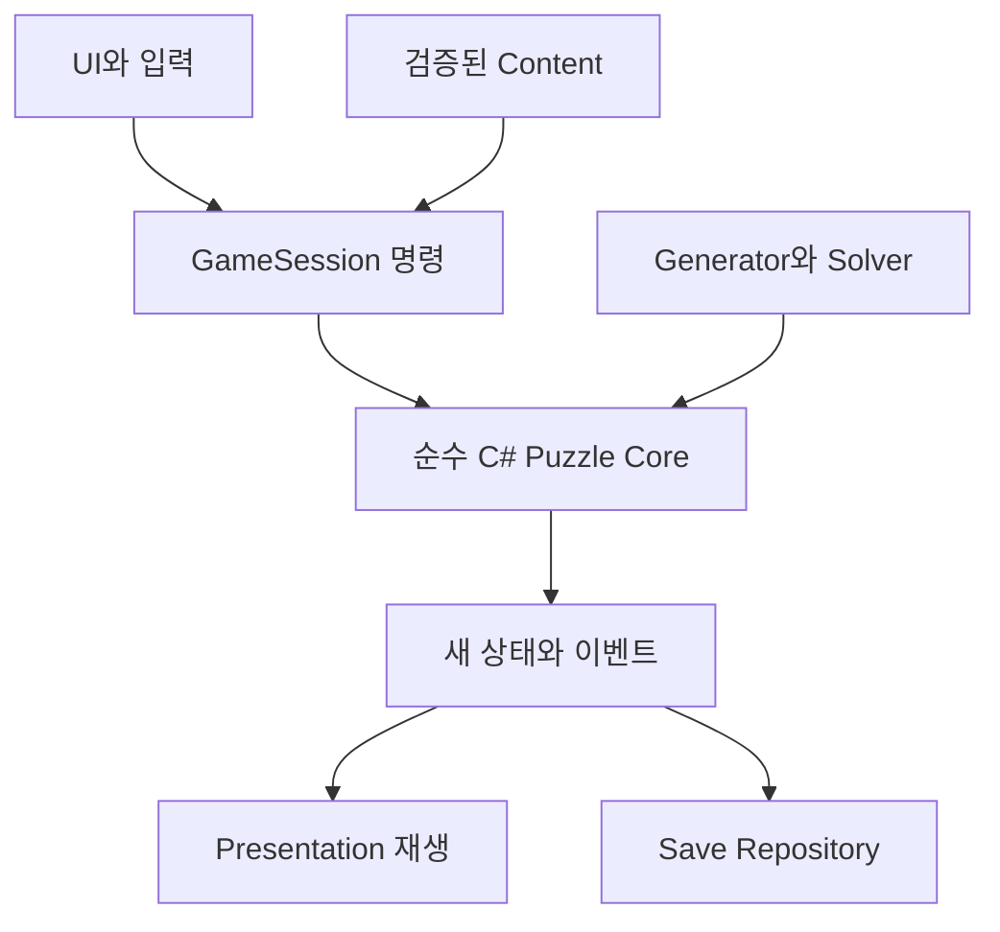

# 엔진·패키지·아키텍처·Android 결정

조사일 2026-09-08. 원작의 엔진은 확인하지 못했다. 아래는 독자 게임에 필요한 기능과 제작 위험을 기준으로 한 선택이다. 프로젝트를 생성하거나 빌드한 결과가 아니다.

## 1. 엔진 결정

**Unity 6.3 LTS, Editor 6000.3.23f1 + URP + C#**를 권장한다. 공식 릴리스 페이지에서 2026-08-26 공개된 패치를 확인했다. ‘오늘 존재하는 가장 최신 패치’라는 주장은 하지 않는다. 이 버전을 첫 재현 가능한 기준으로 삼고, 설치 시 알려진 문제와 Android 빌드를 확인한 뒤 lock한다. Unity 6.3 LTS의 공식 지원은 2027년 12월까지로 안내된다. [T1,T2]

| 요구 | Unity 6.3 / C# / URP | Godot / Mobile 또는 Compatibility |
|---|---|---|
| 3D 조형 | mesh·재질·LOD·import·profiler 도구를 한 환경에서 다룸 | 같은 미감을 구현할 수 있음. 엔진 때문에 귀여움이 제한되는 것은 아님 |
| 실 경로 | 공식 Splines, Mesh API, 에디터 도구 결합 | Curve3D·커스텀 mesh로 가능; 제작 도구를 더 직접 구축 |
| 재질·렌더 | URP Lit/Shader Graph에서 시작, 필요한 부분만 HLSL | Spatial shader로 가능, renderer 간 기능·성능 확인 필요 |
| 모바일 | Android 빌드·IL2CPP·기기 profiler를 첫 단계부터 사용 | Mobile은 현대 GPU 대상, Compatibility는 낮은 사양 대응에 유리 [T7] |
| Codex 코드 작업 | 순수 C# Core와 batchmode 검증에 적합 | GDScript와 텍스트 scene은 자동 수정에 편리 |
| C# Android | 주 경로로 선택 가능 | 공식 문서는 C# Android 지원을 아직 experimental로 설명 [T6] |
| editor automation | C# EditorWindow·importer·scene 생성·빌드를 통일 | EditorPlugin과 import 도구로 가능, 별도 구현량 존재 |
| 공급망·설정 | 패키지와 라이선스 초기 준비가 비교적 무거움 | 오픈소스, 간단한 소스 기반 프로젝트 관리 |
| 이 프로젝트의 판단 | 높은 아트 R&D와 Android 검증을 함께 돌리기 편함 | 비용·엔진 독립성이 최우선이면 GDScript 대안, 현재는 2순위 |

Unity를 선택하는 이유는 C# 문법 선호보다 **털실 생성 도구·시각 튜닝·Android 병목 측정을 같은 작업 흐름에 묶는 것**이다. Godot을 선택하면 광고 없는 게임을 못 만드는 것이 아니다. 이번 우선순위에서 추가 기술 아트 도구 제작 위험을 줄이는 선택이다.

Unity Personal은 공식 안내상 최근 12개월 매출·자금 기준 20만 달러 미만 조건을 둔다. 해당 조건을 충족하는 개인 프로젝트라면 시작 비용을 줄일 수 있다. 유료 Unity 서비스나 Asset Store 구매는 전제하지 않는다. [T8]

## 2. 패키지 결정과 고정 원칙

| 항목 | 선택 | 이유 / 사용 범위 |
|---|---|---|
| Editor | `6000.3.23f1` | 공개 확인한 6.3 LTS 기준 패치 |
| URP | `com.unity.render-pipelines.universal`, 6.3 대응 core / 문서 17.3 계열 | 모바일 opaque 렌더·soft shadow·커스텀 실 재질 |
| Input System | `com.unity.inputsystem` **1.20.0** | 터치·멀티터치·마우스 시뮬레이션·UI 입력 [T4] |
| Splines | `com.unity.splines` **2.9.0** | 에디터 경로 편집·평가; 배포 경로는 baked array 사용 [T3] |
| UI | `com.unity.ugui`, 6.3 대응 core; TextMeshPro | 보관대·버튼·한국어 UI, 명시적인 입력 차단 |
| Tests | `com.unity.test-framework`, 6.3 대응 core | 규칙·solver·save·undo 검증 |
| Serialization | 엔진 경계 DTO + JsonUtility, 기본 파일 API | 초기 데이터에 별도 JSON 라이브러리 불필요 |
| Animation | 작은 자체 tween scheduler + spline/mesh 전용 animator | DOTween 같은 외부 플러그인은 초기 의존성에서 제외 |
| Asset loading | 로컬 Catalog + Unity가 참조하는 Prefab/asset | 12모델 단계에서 Addressables·원격 catalog 불필요 |
| Blender | **4.5 LTS** 계열, 설치한 patch를 제작 manifest에 기록 | Python·Geometry Nodes 제작 기준, 2027-07까지 지원 안내 [T9] |

URP·uGUI·Test Framework는 공식 문서에서 Editor와 함께 버전이 결정되는 core 패키지로 설명된다. 이 문서에서 검증하지 않은 숫자 patch를 임의로 manifest에 쓰지 않는다. 첫 프로젝트 생성 때 해당 Editor의 실제 해석 결과를 `Packages/manifest.json`, `Packages/packages-lock.json`, `ProjectSettings/ProjectVersion.txt`에 고정한다. 위 Input/Splines의 실제 해결 버전도 확인한다. [T3~T5,T10,T11]

처음에는 Burst/Jobs, ECS, VFX Graph, Cinemachine, Addressables, 서드파티 fur, 광고·IAP·Analytics·Services 패키지를 추가하지 않는다. 실 하나만 변형하는 비용이 충분히 작다면 Jobs도 불필요하다. 유료 도구를 도입할 때는 막힌 제작 단계와 절약 시간을 측정한 후 결정한다.

## 3. 논리와 표현의 소유권

Core는 Transform·Mesh·색상 RGB·MonoBehaviour·물리·시간을 모른다. 입력은 `SelectPiece`, `Undo`, `Restart`, `Relax` 같은 명령이다. 출력은 새 논리 상태와 순서가 정해진 domain event다. renderer가 보낸 animation 완료 callback은 진행 표시만 바꾸며 규칙을 결정하지 않는다.

`LevelState`에는 안정된 논리 상태를 둔다. `Resolving`과 `Paused`는 실제 애니메이션/앱 흐름을 관리하는 Session의 표시 phase다. 논리 트랜잭션이 이미 끝났다는 사실과 아직 실이 날아간다는 표시를 구분한다. 02의 phase 표는 이 둘을 합쳐 사용자가 보는 전이를 설명한다.

| 계층 | 타입·책임 |
|---|---|
| Core | LevelState, PieceState, DependencyGraph, ActiveOrder, BufferState, MatchRule, MoveValidator, Normalizer, Outcome |
| Core.Search | Solver, StateKey, SearchBudget, WitnessReplay, 결과 SAT/UNSAT/UNKNOWN |
| Application | GameSession, CommandQueue, UndoHistory, Revision, HintService, ProgressService |
| Presentation | YarnRenderer, YarnAnimation, SupportRenderer, CameraController, OrderView, BufferView, ArtworkView, Audio/Haptics |
| Content | Level/Model DTO, Palette, Theme, Catalog, Asset bindings |
| Infrastructure | 파일 저장, 데이터 migration, Android adapter, serializer adapter |
| Editor | LevelEditor, Generator UI, SolverValidator, DifficultyAnalyzer, VisibilityValidator, Build entrypoints |

Core assembly는 `noEngineReferences`로 엔진 참조를 금지하고, 표준 C# 컬렉션·값 타입으로 구성한다. Unity가 지원하는 C#/.NET 범위 안에서 작성하며 최신 .NET 전용 API를 무심코 가져오지 않는다. `System.Random`의 엔진/런타임 의존성을 피하기 위해 생성기는 버전이 명시된 PRNG를 사용하고 배포 파일은 seed 외 전체 결과도 포함한다.

Python은 Blender geometry 제작에 쓰고, 정식 퍼즐 규칙과 solver는 C# 한 구현을 공유한다. Python generator와 C# 게임에 서로 다른 Normalize를 복제하지 않는다.

## 4. 디렉터리 구조

다음 경로는 생성할 프로젝트의 설계이며 이번 작업에 존재하는 코드 경로가 아니다.

| 경로 | 내용 |
|---|---|
| `Assets/CozyYarn/Core/State/` | 조각·주문·보관·결과 값 타입 |
| `Assets/CozyYarn/Core/Rules/` | 선택 검증·명령 적용·정규화·불변식 |
| `Assets/CozyYarn/Core/Search/` | solver·탐색 key·인증 해답 |
| `Assets/CozyYarn/Application/` | Session·Undo·Hint·저장 시점·진행 |
| `Assets/CozyYarn/Presentation/Yarn/` | 정적 실 renderer·선택 실 풀림·스풀 감기 |
| `Assets/CozyYarn/Presentation/Camera/` | 회전·줌·pan·bounds·safe area |
| `Assets/CozyYarn/Presentation/UI/` | 주문·보관·그림·도감·설정 |
| `Assets/CozyYarn/Presentation/Feedback/` | tween·작은 효과·소리·진동 |
| `Assets/CozyYarn/Infrastructure/` | 파일·DTO serializer·플랫폼 adapter |
| `Assets/CozyYarn/Content/Definitions/` | 확정된 레벨·모델·테마·palette |
| `Assets/CozyYarn/Content/Generated/` | importer가 만든 mesh·prefab·catalog |
| `Assets/CozyYarn/Shaders/` | YarnLit·진행 변수·선택 표시 |
| `Assets/CozyYarn/Editor/Authoring/` | model/level 편집·wrap 가이드 |
| `Assets/CozyYarn/Editor/Validation/` | 논리·기하·시야·성능 정적 예산 검사 |
| `Assets/CozyYarn/Editor/Build/` | 재현 가능한 scene 생성·Android 빌드 |
| `Assets/CozyYarn/Tests/EditMode/` | Core·solver·save 핵심 사례 |
| `Assets/CozyYarn/Tests/PlayMode/` | 입력·revision·중단/재개 경계 |
| `Assets/CozyYarn/Scenes/` | Bootstrap, WoolLab, Game, Gallery |
| `ArtSource/Blender/` | 원본 blend, base part, 가이드, Python script |
| `ArtSource/Recipes/` | 감기 recipe·모델별 제작 설정 |
| `ArtSource/Exports/` | FBX·texture·curve sidecar, exporter manifest |
| `Docs/` | 본 문서·결정 로그·실측 보고·출처 |
| `Packages/` / `ProjectSettings/` | 패키지와 Editor/Android 설정 고정 |

Core, Application, Presentation, Infrastructure, Editor, Tests별 asmdef를 나눠 역참조를 막는다. 초기 부트스트랩은 간단한 composition root로 연결한다. 별도 DI 프레임워크를 넣지 않는다.

## 5. 상태·이벤트 계약

`ApplyCommand`는 검증 실패 시 원상태를 유지한다. 성공하면 하나의 새 revision에 `PieceReleased`, `PieceTransferred`, `OrderCompleted`, `OrderOpened`, `BufferDrained`, `SupportCleared`, `ArtworkRegionCompleted`, `OutcomeChanged`를 필요한 순서로 기록한다. 모든 이벤트에 revision·piece/order ID가 있다.

Undo는 전체 snapshot을 복원하고 이전 revision의 진행 중 effect를 취소한다. Presentation은 snapshot 기준으로 다시 동기화할 수 있어야 한다. 이전 coroutine이 나중에 끝나 새 상태의 조각을 지우는 오류를 막는다. 앱 재개도 같은 재동기화 경로를 사용한다.

Relax는 규칙 용량을 늘리는 하나의 command다. 변경 전 모드·활성 주문·큐·보관을 snapshot으로 남긴다. 세 번째 슬롯에는 다음 주문을 한 번만 열고 자동 drain을 적용한다. Undo로 Relax 직전 상태와 모드를 함께 되돌릴 수 있다. 저장에는 현재 용량과 rulesetVersion이 포함된다.

## 6. 콘텐츠와 표현 연결

모델 exporter는 Unity 좌표 변환·단위·축·stable ID를 manifest에 기록한다. mesh와 curve sidecar를 함께 export하고 importer가 ID별 일치·bounds·총 길이·LOD mapping을 검사한다. Blender의 modifier나 재질 node가 Unity에서 그대로 실행된다고 기대하지 않는다.

정적 mesh는 레벨 로드 시 준비하고, 선택된 한 실만 동적 mesh 또는 index 범위를 수정한다. Piece가 논리적으로 Board를 떠났어도 시각 객체는 animation 종료까지 남을 수 있다. 이 객체는 더 이상 입력 대상이 아니며 논리 blocker를 재생성하지 않는다.

도감 모델과 플레이 모델은 같은 원본에서 나온다. 도감은 모든 실이 복원된 정적 표시이며 저장된 물리 simulation 결과가 아니다. 그림 마스크는 주문 ID를 참조하고 일부 주문이 큰 면적을 차지하더라도 완료 판정은 Core 전체 수집 조건만 사용한다.

## 7. Android 빌드 기준

| 설정 | 첫 기준 / 검증 사항 |
|---|---|
| 배포 | 개인 설치용 서명 APK. Play Store 출시 파이프라인은 초기 범위 밖 |
| CPU / scripting | ARM64, IL2CPP |
| 최소 OS | Android 8 / API 26을 프로젝트 목표로 시작. 아내의 실제 기기 확인 후 지원 범위 조정 |
| target / compile | API 36 설치·빌드 목표. 스토어의 법적/정책 최소 요구라고 주장하지 않음 |
| Graphics API | OpenGLES3을 호환성 기준으로 먼저 검증. Vulkan은 같은 씬을 측정한 뒤 활성화 여부 결정 |
| 방향 | Portrait, safe area 반영 |
| color / render | Linear, URP Forward, HDR off 시작, 2× MSAA 출발 |
| 품질 | 보통/가볍게 2단계; 04의 LOD·shadow·geometry 예산 적용 |
| SDK 도구 | Hub 6.3 모듈 기준 Build tools 36.0.0, command-line 16, platform tools 36.0.0 [T12] |
| NDK / JDK | r27c `27.2.12479018` / OpenJDK 17, Hub 제공 버전 우선 [T12] |
| 서명 | 개발용과 배포용 구분. keystore·비밀번호는 git에 넣지 않음 |
| 권한 | release merged manifest 검사. 필수 게임 흐름에 네트워크·연락처·위치 권한 불필요 |

기기 모델을 아직 모르므로 ‘아내의 폰에서 60fps’라고 확정할 수 없다. 우선 보통 Android 기기와 낮은 사양 기기에서 15분 연속 플레이를 측정하고, 이후 실제 기기를 최종 수용 대상으로 한다. 이 요청 단계에서는 사용자에게 기기나 영상을 요구하지 않는다.

프레임 시간·메모리·draw call·thermal 변화는 Development Build로 원인을 찾고 최종 성능은 release에서도 재측정한다. Editor fps, Blender 렌더, 에뮬레이터 결과를 실기기 성능 증거로 사용하지 않는다.

## 8. Codex가 수정하기 쉬운 작업 방식

Scene과 prefab을 C# Editor 생성기에서 재현 가능하게 만든다. 동일 명령을 반복해도 자산이 중복되지 않아야 한다. 수작업으로 만든 아트 설정은 recipe/asset으로 보존하며 재생성할 때 덮어쓸 경계를 명시한다. Codex가 거대한 Unity YAML을 추정해서 직접 고치는 것을 기본 경로로 삼지 않는다.

각 단계는 import → compile → 핵심 검증 → Editor 실제 화면 → Android 실기기 순으로 확인한다. 엔진 실행 권한·라이선스·Android 모듈이 없으면 그 상태를 기록하고 실행하지 않은 검증을 통과로 보고하지 않는다. 설치 불가를 게임 코드의 완성으로 포장하지 않는다.

테스트는 규칙·연쇄 이동·undo·저장·solver 인증처럼 오류가 실제 퍼즐에 영향을 주는 부분에 집중한다. RGB 상수나 단순 버튼 문구를 복제한 테스트를 늘리지 않는다. 아트는 실제 렌더와 사람이 보는 품질 게이트로 평가한다.

## 9. 공식 기술 출처

조회일 2026-09-08. 버전 선택의 사실과 이 프로젝트의 판단을 구분한다.

- T1: [Unity 6000.3.23f1 릴리스](https://unity.com/releases/editor/whats-new/6000.3.23f1).
- T2: [Unity 6 릴리스·지원 정책](https://unity.com/releases/unity-6).
- T3: [Unity 6.3 Splines 2.9.0](https://docs.unity3d.com/6000.3/Documentation/Manual/com.unity.splines.html).
- T4: [Unity 6.3 Input System 1.20.0](https://docs.unity3d.com/6000.3/Documentation/Manual/com.unity.inputsystem.html).
- T5: [Unity 6.3 URP core package](https://docs.unity3d.com/6000.3/Documentation/Manual/com.unity.render-pipelines.universal.html).
- T6: [Godot Android export / C# 지원 상태](https://docs.godotengine.org/en/stable/tutorials/export/exporting_for_android.html).
- T7: [Godot renderer 비교](https://docs.godotengine.org/en/stable/tutorials/rendering/renderers.html).
- T8: [Unity Personal 조건](https://unity.com/products/unity-personal).
- T9: [Blender 4.5 LTS](https://www.blender.org/releases/4-5/) — 공식 검색 노출 정보 확인; 본문 재조회는 접근 오류.
- T10: [Unity uGUI core package](https://docs.unity3d.com/6000.3/Documentation/Manual/com.unity.ugui.html).
- T11: [Unity Test Framework core package](https://docs.unity3d.com/6000.3/Documentation/Manual/com.unity.test-framework.html).
- T12: [Unity 6.3 Android dependency versions](https://docs.unity3d.com/6000.3/Documentation/Manual/android-supported-dependency-versions.html).
